# Contact Manager Application

A simple **Console-Based Contact Manager Application** that allows users to manage contacts efficiently through a command-line interface.

## Features

The application supports the following operations:

- View all contacts
- Add a new contact
- Search contacts
- Edit existing contacts
- Delete contacts

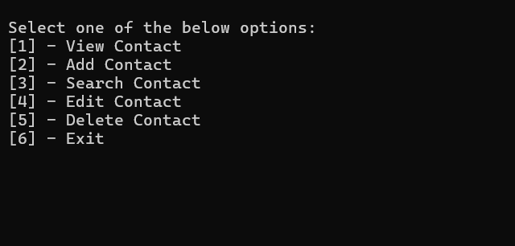

---

## Contact Structure

Each contact contains the following information:

| Field             | Required | Description                                |
|-------------------|----------|--------------------------------------------|
| Contact ID (GUID) | Yes      | System-generated unique identifier         |
| Name              | Yes      | Contact name                               |
| Phone Number      | Yes      | 10-digit numeric phone number              |
| Email             | No       | Valid email address                        |
| Notes             | No       | Additional information (max 50 characters) |

---

## Validation Rules

### Name Validation

The contact name:

- Cannot be empty
- Must contain at least **2 characters**
- Leading and trailing spaces are ignored

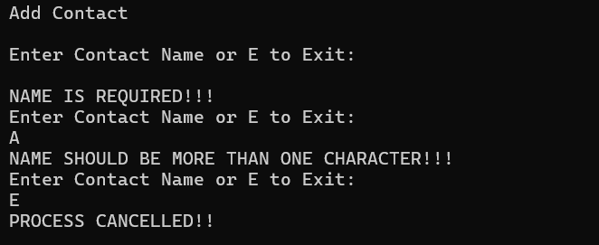

### Phone Number Validation

The phone number:

- Is mandatory
- Must contain exactly **10 digits**
- Must contain only numeric characters

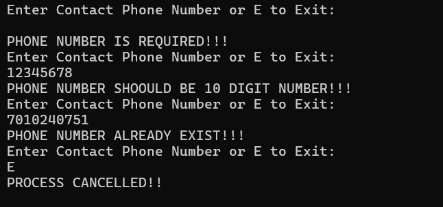

### Email Validation

The email field is optional.

If provided:

- Must follow a valid email format
- Must contain a valid username and domain

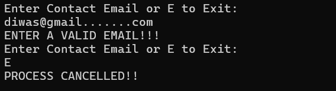

### Notes Validation

The notes field:

- Is optional
- Must not exceed **50 characters**

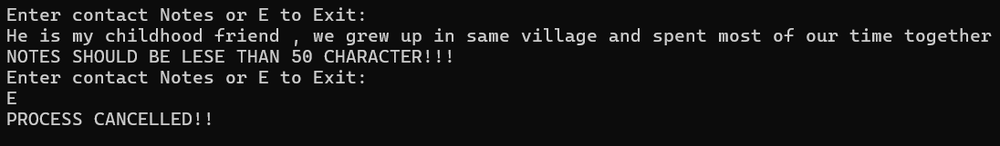

---


## Contact Identification

Every contact is assigned a unique **GUID** when created.

### Benefits of Using GUIDs

- Ensures uniqueness across all contacts
- Prevents conflicts when contacts have the same name
- Provides reliable identification for Edit and Delete operations

---


## Functional Overview

### View Contacts

Displays all contacts in a sorted list including:

- Name
- Phone Number
- Email
- Notes

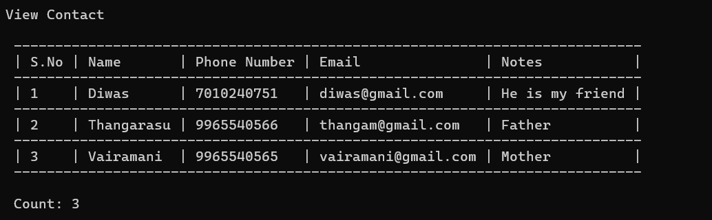

### Add Contact

Creates a new contact after validating:

- Name
- Phone Number
- Email (if provided)
- Notes (if provided)

A GUID is automatically generated and assigned.

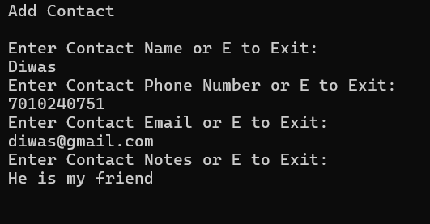

### Search Contact

Search by:

- Name
- Email
- Phone Number

### Search Features
- Partial matching supported
- Case-insensitive search for text fields
- Returns matching contacts in a sorted order

Returns sorted matching results.

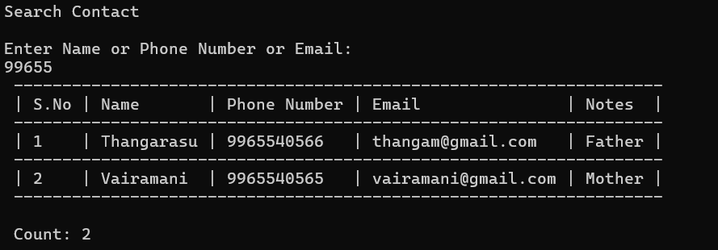

### Edit Contact

- Select a contact using its GUID
- Update one or more fields
- Revalidate updated values before saving

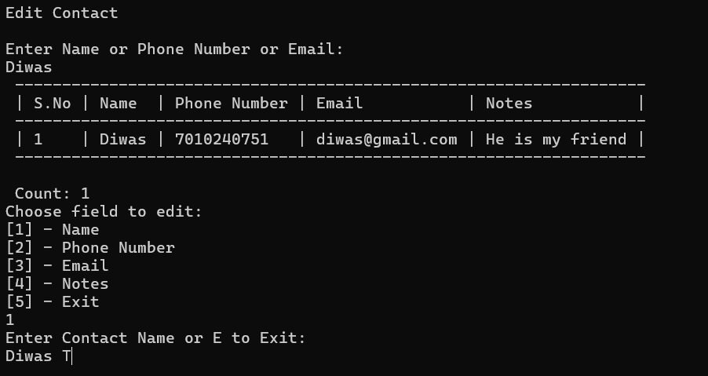
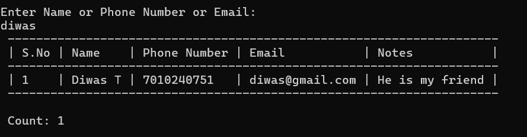

### Delete Contact

- Select a contact using its GUID
- Remove the contact from the system

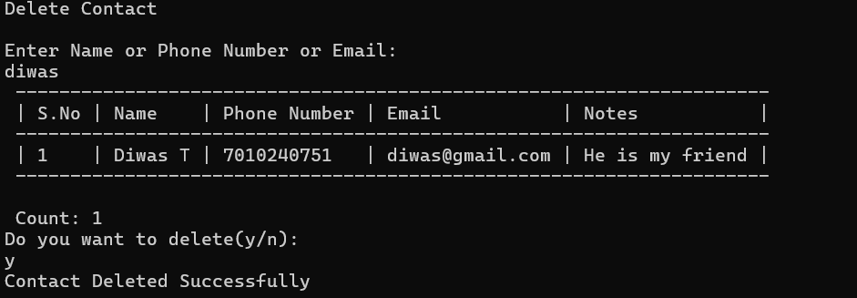

---

## Error Handling

The application displays appropriate validation messages such as:

- Name cannot be empty.
- Name must contain at least 2 characters.
- Phone number is required.
- Phone number must contain exactly 10 digits.
- Email format is invalid.
- Notes cannot exceed 50 characters.
- Contact not found.
- Invalid menu selection.

---

## Technologies

- Console Application
- GUID-based Contact Identification
- Input Validation
- CRUD Operations (Create, Read, Update, Delete)

---

## Project Structure

```
ContactManager
│
├── Constants
│   ├── MessageConstants.cs
│   └── RegexPatterns.cs
│
├── Helper
│   └── Validation.cs
│
├── Models
│   └── ContactInfo.cs
│
├── Repository
│   └── ContactRepository.cs
|
├── Services
│   └── ContactController.cs
│
├── View
│   └── ConsoleOperations.cs
│
├── Program.cs
├── README.md
```

### Folder Descriptions

#### Constants
Contains application-wide constant values.

- **MessageConstants.cs** - Stores user-facing messages, error messages, and success messages.
- **RegexPatterns.cs** - Stores regular expression patterns used for validation such as email and phone number validation.

#### Helper
Contains utility and helper classes.

- **Validation.cs** - Handles validation logic for contact information including name, phone number, email, and notes.

#### Models
Contains data models used by the application.

- **ContactInfo.cs** - Represents a contact entity with properties such as:
  - Guid Id
  - Name
  - Phone Number
  - Email
  - Notes

#### Repository
Responsible for data storage and retrieval operations.

- **ContactRepository.cs** - Manages CRUD operations for contacts and maintains the contact collection.

#### Services
Contains business logic.

- **ContactController.cs** - Coordinates interactions between the repository, validations, and user interface operations.

#### View
Contains user interface related functionality.

- **ConsoleOperations.cs** - Handles menu display, user input, and output to the console.

#### Screenshots
Stores screenshots of application execution for documentation purposes.

#### Program.cs
Application entry point that initializes and starts the Contact Manager application.

---

## Architecture

The application follows a simple layered architecture:

```
Console UI (View)
        │
        ▼
Service Layer (ContactController)
        │
        ▼
Repository Layer (ContactRepository)
        │
        ▼
Model Layer (ContactInfo)
```

### Flow

1. User selects an option from the console menu.
2. `ConsoleOperations` captures user input.
3. `ContactController` processes the request.
4. `Validation` verifies input data.
5. `ContactRepository` performs CRUD operations.
6. Results are displayed back to the user through the console.

This separation of concerns improves maintainability, readability, and future extensibility of the application.

## Author

**Diwas Thangarasu**