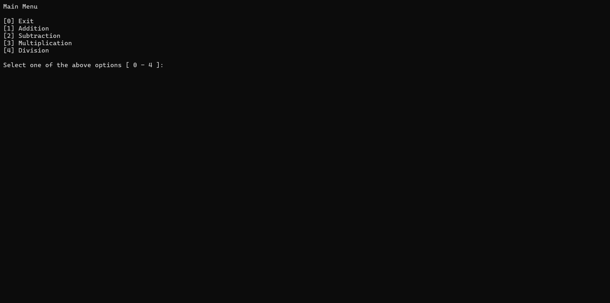
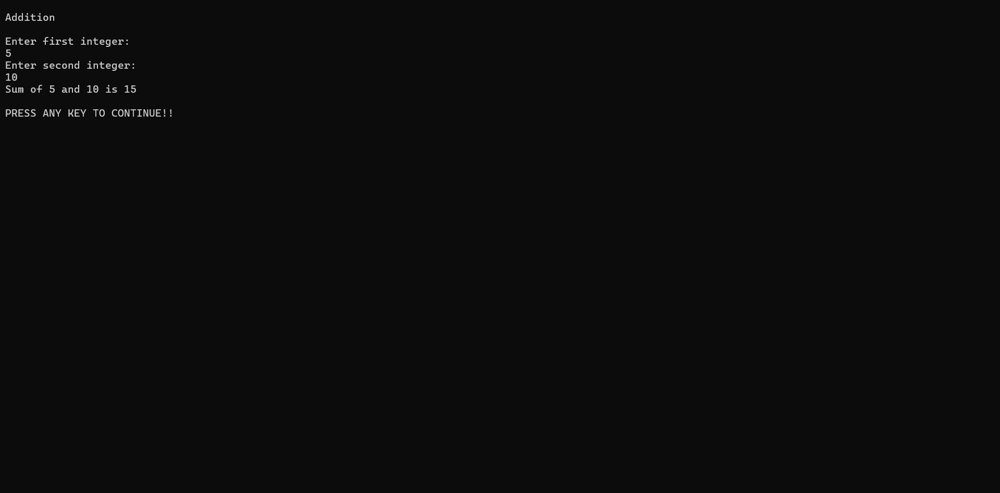
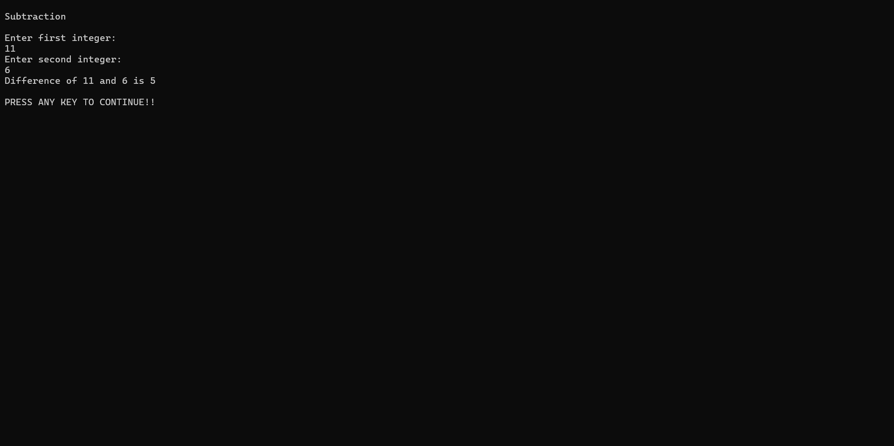
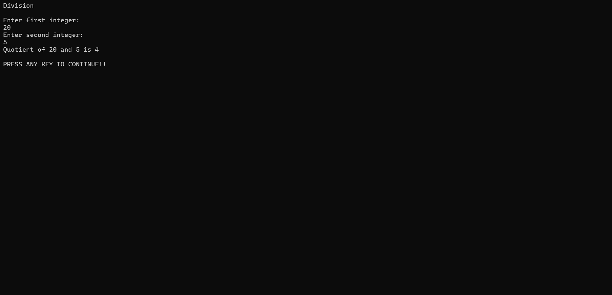
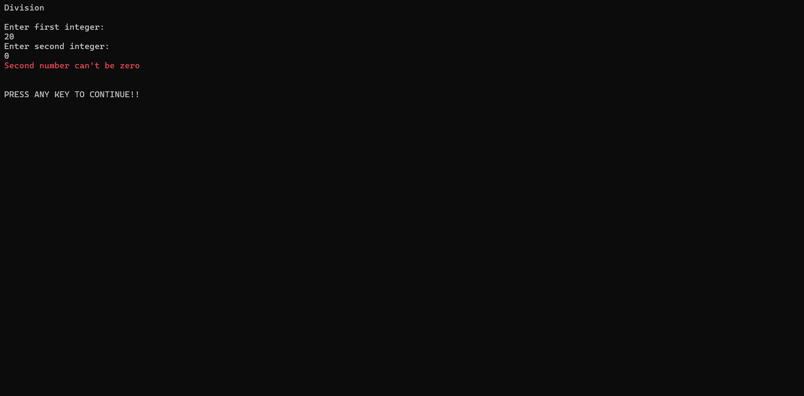

# .NET Fundamentals and Calculator Application

This project demonstrates an understanding of core .NET concepts along with a practical implementation of a calculator application developed using C#.

---

## Project Summary

The assignment is divided into two sections:

- Research and documentation of fundamental .NET concepts.
- Development of a calculator application utilizing a reusable utility class.

---

## Topics Covered

The following concepts were explored and documented as part of the learning process:

1. Introduction to the .NET ecosystem
2. Architecture and components of .NET
3. Common Language Runtime (CLR) and Common Type System (CTS)
4. Global Assembly Cache (GAC)
5. Differences between Value Types and Reference Types
6. Garbage Collection mechanism
7. Globalization and Localization support in .NET
8. Common Intermediate Language (CIL) and Just-In-Time (JIT) Compilation

---

## Calculator Implementation

A dedicated `MathUtils` class was created to handle arithmetic operations, including:

- Addition
- Subtraction
- Multiplication
- Division

The console application allows users to:

- Enter two integer values.
- Execute arithmetic operations using the utility class.
- View the calculated results in the console.

---

## Key Features

### Arithmetic Operations

The application supports:

- Add
- Subtract
- Multiply
- Divide

### Validation and Error Handling

- Validates user input to ensure integers are entered.
- Prevents application failures caused by invalid input.
- Handles division-by-zero cases appropriately.

### User Experience

- Provides a menu-driven interface.
- Allows users to perform multiple calculations during a single session.
- Displays clear success and error messages.

## Project Structure

```text
Calculator
├── Constants
│   ├── ErrorMessages.cs
│   ├── SuccessMessages.cs
│   └── UserPrompts.cs
├── Docs
│   ├── Assets
│   ├── Answers.md
│   └── README.md
├── Enums
│   └── MainMenu.cs
├── CalculatorController.cs
├── CalculatorView.cs
├── MathUtils.cs
├── Program.cs
└── .editorconfig
```

---

## Approach

- Explored and written the theoretical concepts related to the .NET platform.
- Implemented the calculator functionality using a separate utility class.

---

## Screenshots

### Calculator Output









### Division by Zero Handling



---

## Prerequisites

- .NET 6 SDK or later
- Visual Studio 2022 or later

---

## Author

**Diwas Thangarasu**