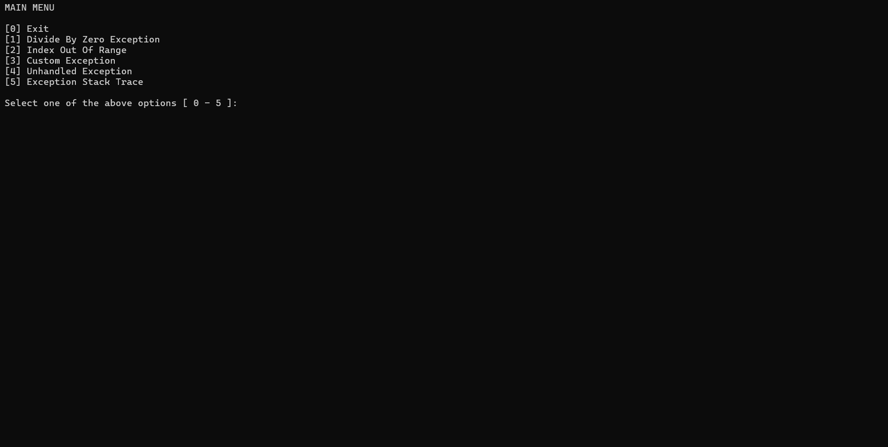
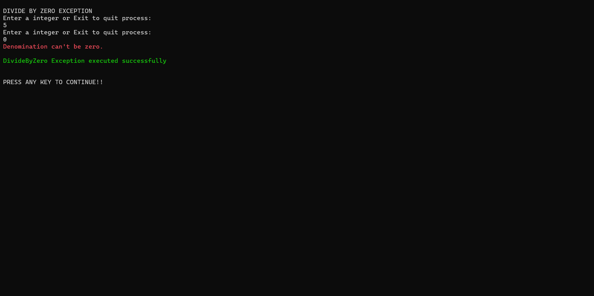
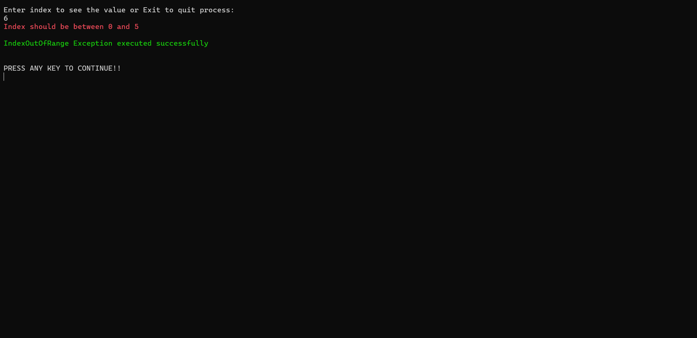
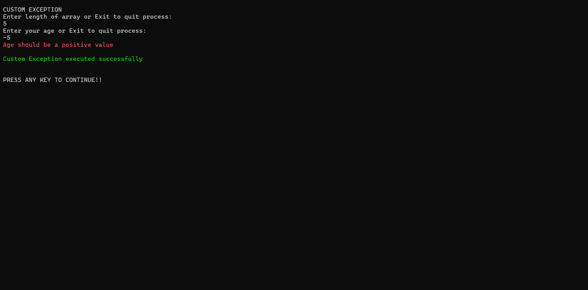
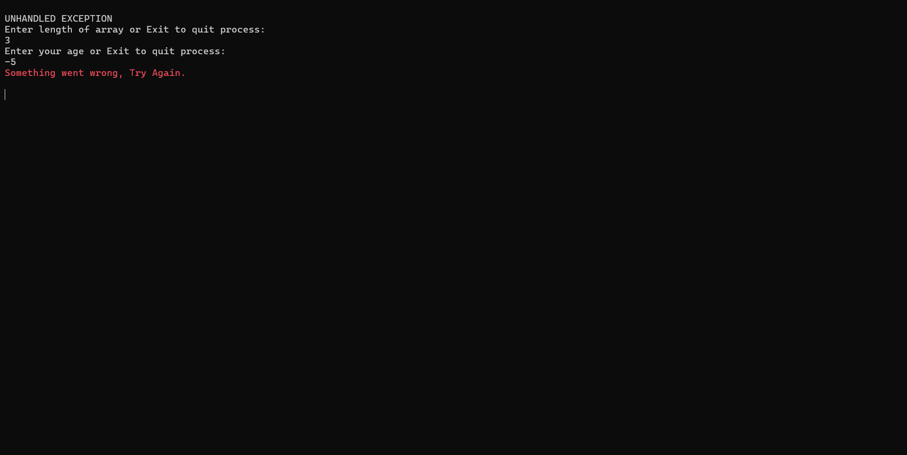
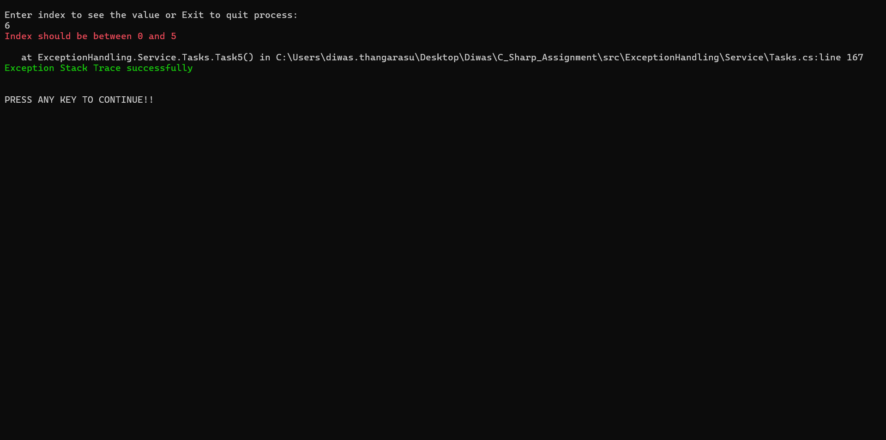

# Exception Handling Application

A comprehensive C# console application demonstrating various exception handling techniques and best practices.

## Overview

This application showcases five different exception handling scenarios:
1. **DivideByZeroException** - Basic exception handling with try/catch/finally
2. **IndexOutOfRangeException** - Array access error handling
3. **Custom Exception Handling** - User-defined exception classes
4. **Unhandled Exception Handling** - Global exception handler registration
5. **Stack Trace Demonstration** - Exception stack trace analysis

## Features

- **Exception Handling Demonstrations**: Learn different exception handling patterns
- **Custom Exceptions**: Implementation of `InvalidUserInputException`
- **User Input Validation**: Robust input validation for user entries
- **Console UI**: Interactive menu-driven interface
- **Color-Coded Output**: Visual feedback for errors (red) and success (green)
- **Code Quality**: StyleCop analyzer integration for consistent code style

## Usage Guide

### Application Flow

Upon launching the application, you'll see the main menu:

### Navigation Instructions

- Enter a number (0-5) to select an option
- Type "Exit" at any input prompt to return to main menu
- Press any key after each task completes to continue

### Task Descriptions

#### Task 1: DivideByZeroException

Purpose: Demonstrates basic exception handling with try/catch/finally blocks

What It Does:
- Prompts for two integers
- Performs division (numerator / denominator)
- If denominator is 0, DivideByZeroException is caught
- Displays error message in red
- Always executes finally block showing success message

#### Task 2: IndexOutOfRangeException

Purpose: Demonstrates array access error handling and exception throwing

What It Does:
- Prompts for array length
- Takes integer inputs for array elements
- Asks for an index to access
- If index is out of range, IndexOutOfRangeException is caught
- Displays error message and success message

#### Task 3: CustomException

Purpose: Demonstrates custom exception creation and handling

What It Does:
- Creates InvalidUserInputException for age validation
- Prompts for array length
- Validates each entry (age must be > 0)
- Throws custom exception if age is negative
- Catches custom exception separately from other exceptions
- Access array by index

#### Task 4: UnhandledException

Purpose: Demonstrates global unhandled exception handler

What It Does:
- Registers AppDomain.CurrentDomain.UnhandledException event handler
- Similar flow to Task 3
- Handles both custom and index exceptions
- Shows how to catch unhandled exceptions at application level

#### Task 5: StackTrace

Purpose: Demonstrates exception stack trace analysis

What It Does:
- Similar to Task 3 flow
- When exception occurs, captures and displays the stack trace
- Shows method names, file names, and line numbers
- Displays complete call chain leading to exception

## Key Classes and Methods

### Program.cs
Entry point of the application with menu navigation

Methods:
- Main() - Initializes UI and Tasks, starts application
- GetMenuOption() - Displays menu and routes to selected task

### ConsoleUI.cs
Handles all console input/output operations

Key Methods:
- DisplayMessage(string message) - Output text to console
- DisplayErrorMessage(string errorMessage) - Output error in red color
- DisplaySuccessMessage(string successMessage) - Output success in green color
- GetIntegerInput(string prompt) - Validates and returns integer input
- GetStringInput(string prompt) - Validates and returns string input
- GetMenuChoice<T>(string message, string prompt) - Generic menu selection
- ClearConsole() - Clears console screen
- GetAnyKey() - Waits for user key press

### Tasks.cs
Contains all five exception handling demonstrations

Methods:
- Task1() - DivideByZeroException demonstration
- Task2() - IndexOutOfRangeException demonstration
- Task3() - Custom exception handling
- Task4() - Unhandled exception handling
- Task5() - Stack trace demonstration
- UnhandledException() - Global exception event handler

## Constants

### ErrorMessages.cs
- InvalidOption - Invalid menu selection
- InvalidNumber - Invalid number input
- DivideByZero - Division by zero error
- InvalidString - Empty string input
- InvalidIndex - Array index out of range
- InvalidAge - Negative age value
- InvalidMessage - General error message

### HeaderMessages.cs
- Exit - Exit command
- MainMenu - Main menu header
- DivideByZeroException - Task 1 header
- IndexOutOfRange - Task 2 header
- CustomException - Task 3 header
- UnhandledException - Task 4 header
- StackTrace - Task 5 header

### SuccessMessages.cs
- ProcessEnded - Application closing message
- ProcessCancelled - Process cancellation message
- Task1 through Task5 - Task completion messages

### UserPrompts.cs
- SelectOption - Menu selection prompt
- ExitProcess - Exit instruction
- GetAnyKey - Any key press prompt
- GetInteger - Integer input prompt
- GetIndex - Array index prompt
- GetLength - Array length prompt
- GetAge - Age input prompt

## Testing Information

### Test Type
Manual testing with various user input scenarios

### Test Scenarios Covered
- Valid numeric input processing.

- Division by zero condition handling.

- Array boundary condition testing.

- Negative number (age) validation.

- Menu option validation.

- Exit command functionality.

- Stack trace generation.

- Exception message display.

- Color-coded output verification.

## Notes

- The application is fully interactive with user-friendly prompts
- Type "Exit" at any input prompt to return to main menu
- All inputs are case-insensitive for menu selections
- Exceptions are caught and displayed in user-friendly format
- Stack traces include file paths and line numbers for debugging
- Color output works on Windows, Linux, and macOS terminals
- Application handles null reference checks throughout