# Expense Tracker

A simple **Console-Based Expense Tracker** application developed in **C#** following a layered architecture pattern. The application allows users to manage income and expense transactions, track financial records, and generate summaries through an interactive console menu.

---

## Features

- Add Income and Expense transactions
- View all transactions
- Update existing transactions
- Delete transactions
- Generate expense summary
- Input validation for amount, date, and description
- In-memory data storage
- Clean separation of concerns using Controller, Service, Repository, and Model layers

---

## Project Architecture

The application follows a layered architecture:

```text
User
 │
 ▼
Console UI
 │
 ▼
Controllers
 │
 ▼
Services
 │
 ▼
Repositories
 │
 ▼
In-Memory Data Store
```

### High-Level Design

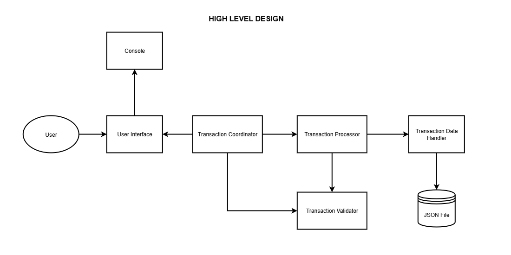

### UML Diagram

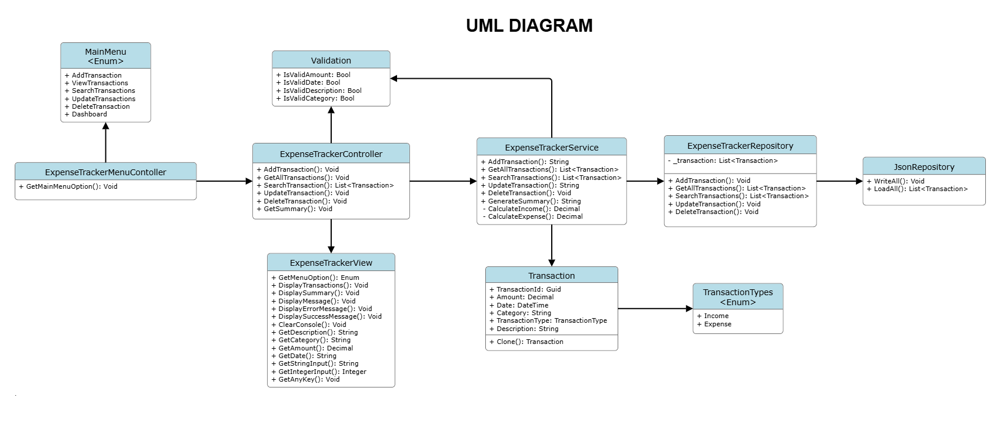

## Project Structure

```text
ExpenseTracker
│
├── Constants
│   ├── Configurables.cs
│   ├── ErrorMessages.cs
│   ├── HeaderMessages.cs
│   ├── RegexPatterns.cs
│   ├── SuccessMessages.cs
│   └── UserPrompts.cs
│
├── Controller
│   ├── IController.cs
│   ├── MainMenuController.cs
│   └── TransactionController.cs
│
├── Enums
│   ├── MainMenu.cs
│   ├── TransactionFields.cs
│   └── TransactionTypes.cs
│
├── Helper
│   └── Validation.cs
│
├── Models
│   └── Transaction.cs
│
├── Repository
│   ├── IRepository.cs
│   └── TransactionRepository.cs
│
├── Service
│   ├── IService.cs
│   └── TransactionService.cs
│
└── Docs
    └── Assets
        ├── HLD.png
        └── UMLDiagram.png
```

---

## Application Flow

1. User selects an option from the main menu.
2. Controller receives and processes the request.
3. Service layer applies business rules and validations.
4. Repository layer performs CRUD operations.
5. Data is stored in an in-memory collection.
6. Results are displayed back to the user through the console.

---

## Core Components

### Controller Layer

Responsible for handling user interactions and routing requests.

- `MainMenuController`
  - Displays menu options.
  - Handles menu navigation.

- `TransactionController`
  - Add transactions.
  - View transactions.
  - Update transactions.
  - Delete transactions.
  - Generate summaries.

---

### Service Layer

Contains business logic and transaction processing.

- `TransactionService`
  - Processes transaction operations.
  - Calculates total income.
  - Calculates total expenses.
  - Generates financial summaries.

---

### Repository Layer

Acts as the data access layer.

- `TransactionRepository`
  - Stores transaction data.
  - Performs CRUD operations.
  - Maintains in-memory transaction collection.

---

### Validation Layer

Ensures valid user inputs.

Validates:

- Transaction Amount
- Transaction Date
- Description
- Required Fields

---

### Model

#### Transaction

Represents a financial transaction.

| Property | Type |
|-----------|--------|
| TransactionId | Guid |
| Amount | Decimal |
| Date | DateTime |
| TransactionType | TransactionTypes |
| Description | String |

---

## Transaction Types

```csharp
public enum TransactionTypes
{
    Income,
    Expense
}
```

---

## Main Menu Options

```text
0. Exit
1. Add Transaction
2. View Transactions
3. Search Transaction
4. Delete Transaction
5. Delete All Transactions
6. Update Transaction
7. Summary
```

---

## Design Principles Used

- Separation of Concerns (SoC)
- Layered Architecture
- Repository Pattern
- Dependency Abstraction through Interfaces
- Single Responsibility Principle (SRP)
- Reusable Validation Logic

---

## Data Storage

Currently, transactions are stored using an **in-memory collection**.

Benefits:
- Fast access
- Simple implementation
- Ideal for learning and demonstration purposes


---

## Sample Usage

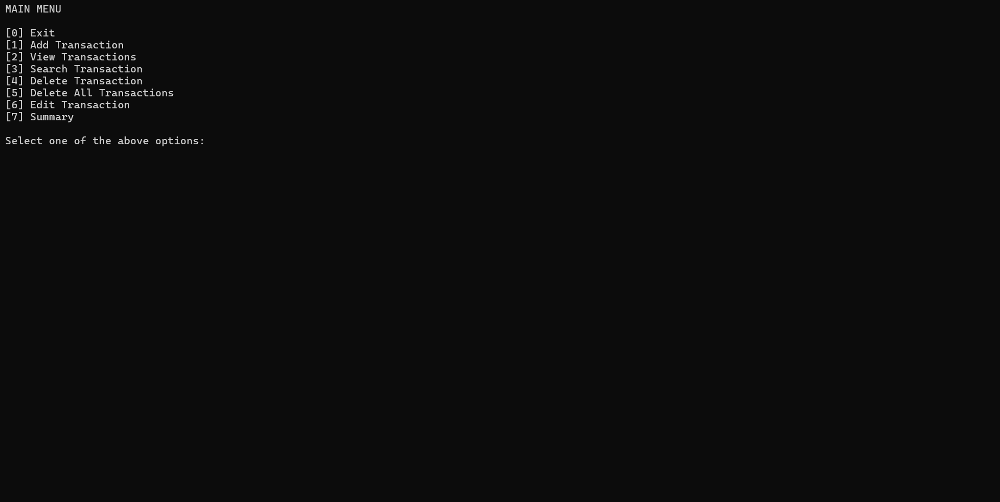
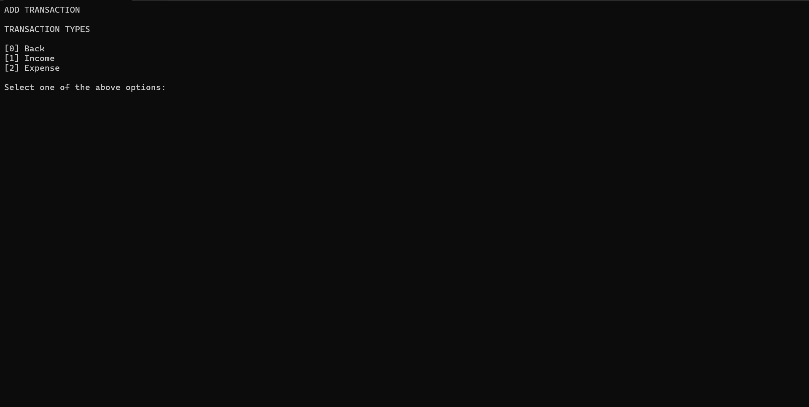
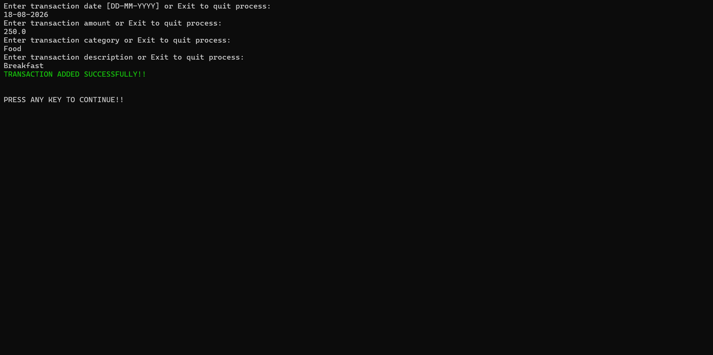
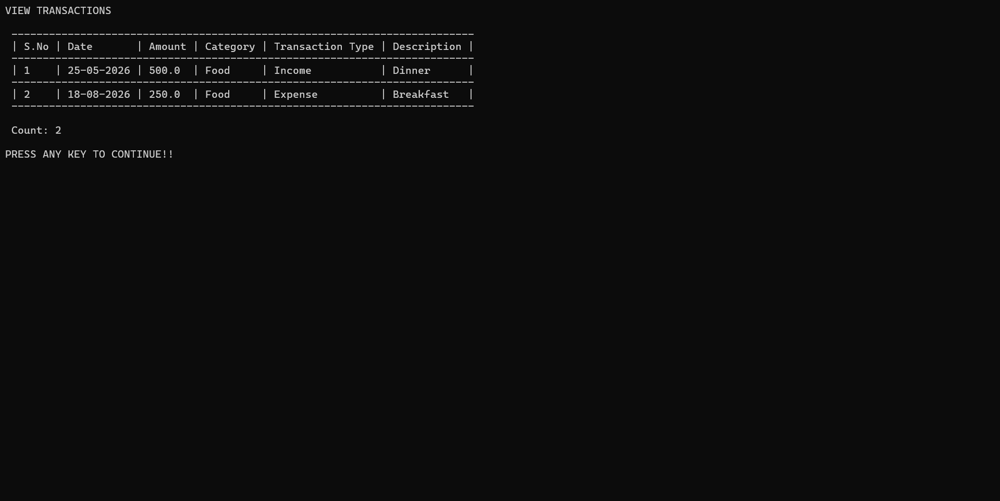
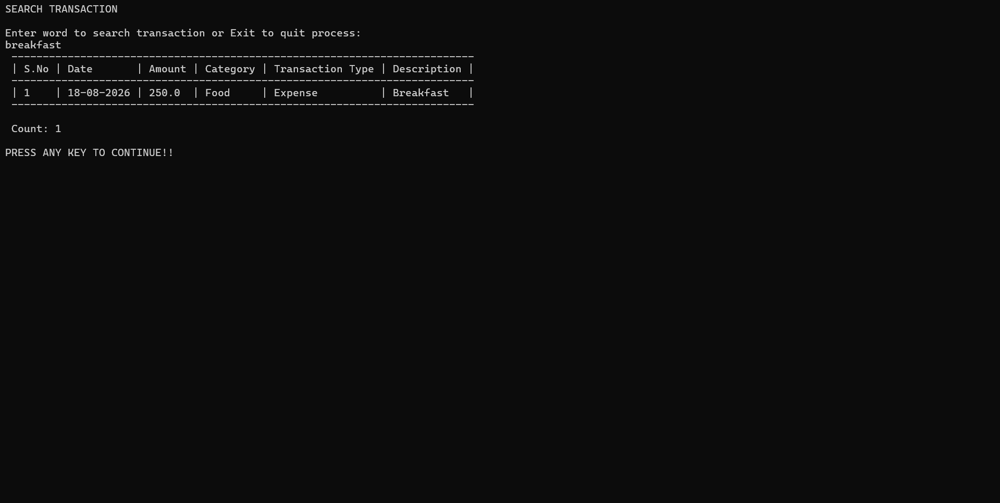
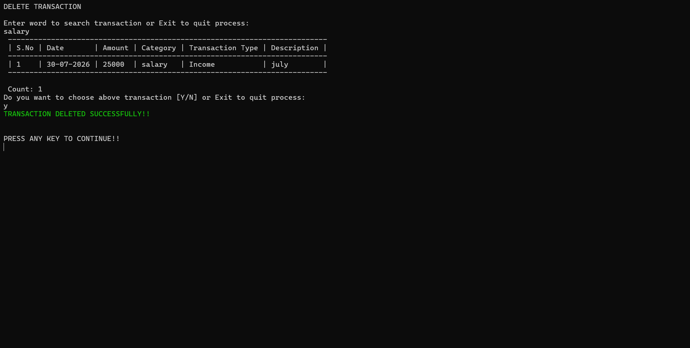
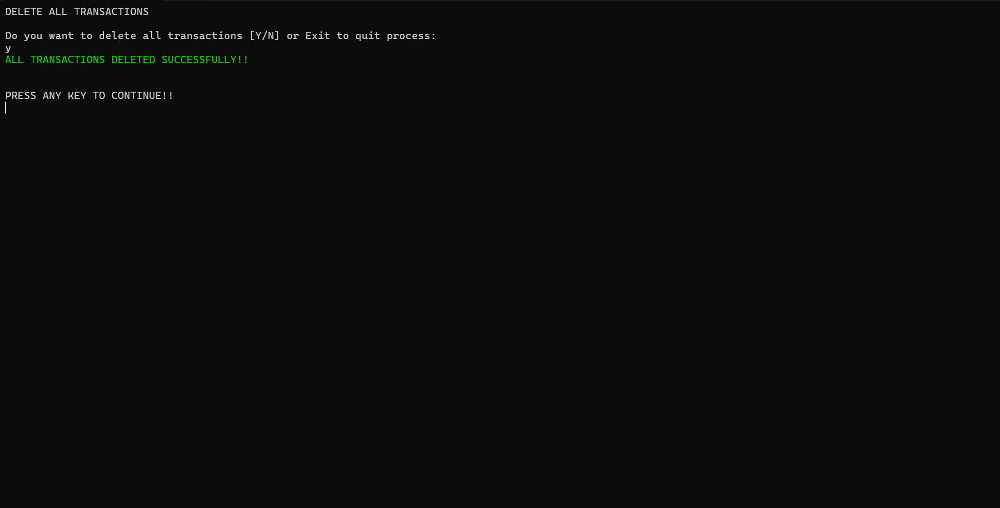
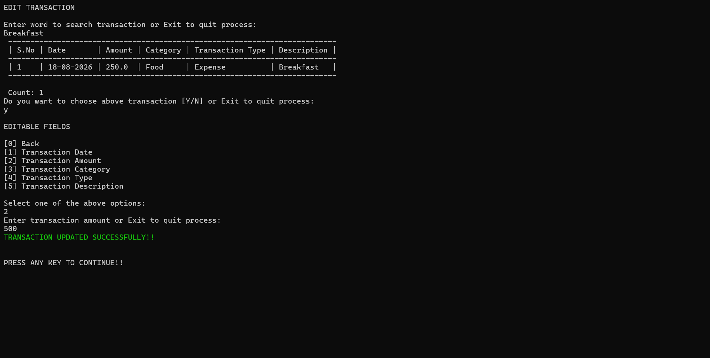

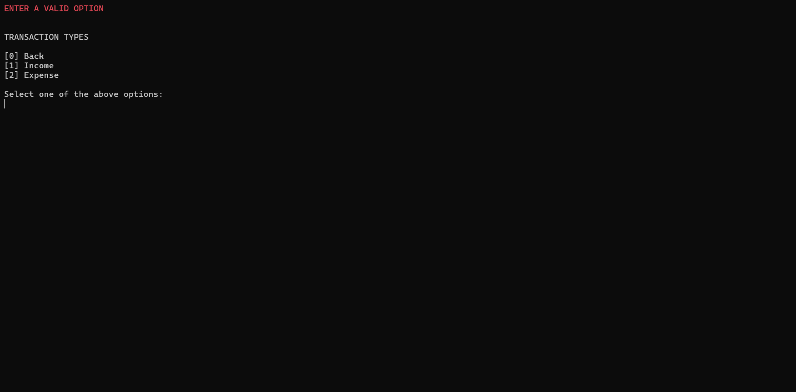


---

## Author

Developed as a learning project to demonstrate:

- C# Console Application Development
- Layered Architecture
- Repository Pattern
- CRUD Operations
- Object-Oriented Programming Principles

---
