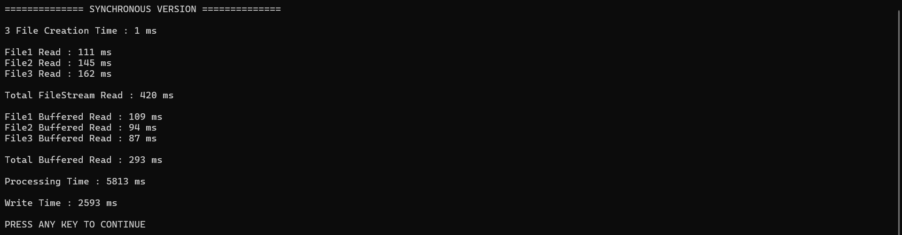

# Large File Processing with FileStream, BufferedStream, and MemoryStream

## Overview

This console application demonstrates efficient file processing techniques in .NET using various stream classes. The application generates a large data file (approximately 1 GB), reads the file using different approaches, processes the data, and writes the processed data to a new file.

The primary objective is to compare the performance of `FileStream` and `BufferedStream` when reading large files and to demonstrate the use of `MemoryStream` for buffered output operations.

---

# Objectives

The application performs the following tasks:

1. Generate a large test file (~1 GB).
2. Read the file using `FileStream`.
3. Read the file using `BufferedStream`.
4. Compare read performance.
5. Process the file contents by converting text to uppercase.
6. Write the processed data to a new file using `MemoryStream`.
7. Measure and analyze execution times.

---

# Project Workflow

```text
Generate Data File
        ↓
Read with FileStream
        ↓
Read with BufferedStream
        ↓
Compare Performance
        ↓
Process Data
(Convert to Uppercase)
        ↓
Write Processed Data
Using MemoryStream
```

---

# Large File Generation

## Purpose

A large file is required to accurately measure read performance and simulate real-world data processing.

The generated file contains weather-related records.

### Sample Record

```text
weather,data,24.5,humidity,70,pressure,1013
```

### Implementation

```csharp
private void GenerateFile(string path, int recordCount)
{
    if (File.Exists(path))
    {
        return;
    }

    using FileStream fileStream =
        new(path, FileMode.Create, FileAccess.Write);

    using StreamWriter writer = new(fileStream);

    string line =
        "weather,data,24.5,humidity,70,pressure,1013";

    StringBuilder block = new();

    for (int i = 0; i < 10000; i++)
    {
        block.AppendLine(line);
    }

    string largeBlock = block.ToString();

    for (int i = 0; i < recordCount / 10000; i++)
    {
        writer.Write(largeBlock);
    }
}
```

---

## Benefits

- Generates large-scale test data quickly.
- Minimizes write operations using batch writes.
- Simulates realistic weather dataset records.
- Suitable for performance benchmarking.

---

# Reading with FileStream

## Purpose

Measure how long it takes to read the entire file using a standard `FileStream`.

### Implementation

```csharp
private long ReadWithFileStream(string path)
{
    Stopwatch stopWatch = Stopwatch.StartNew();

    using FileStream fileStream =
        new(path, FileMode.Open, FileAccess.Read);

    byte[] buffer = new byte[BufferSize];

    while (fileStream.Read(buffer, 0, buffer.Length) > 0)
    {
    }

    stopWatch.Stop();

    return stopWatch.ElapsedMilliseconds;
}
```

---

## How It Works

1. Opens the file.
2. Reads data in chunks using a byte buffer.
3. Continues until the end of the file.
4. Measures total read duration.

### Advantages

- Simple implementation.
- Direct file access.
- Suitable for general file operations.

### Limitations

- Each read operation directly accesses the underlying stream.
- Higher I/O overhead compared to buffered approaches.

---

# Reading with BufferedStream

## Purpose

Improve read efficiency by introducing an additional memory buffer between the application and the file system.

### Implementation

```csharp
private long ReadWithBufferedStream(string path)
{
    Stopwatch stopWatch = Stopwatch.StartNew();

    byte[] buffer = new byte[BufferSize];

    using FileStream fileStream =
        new(path, FileMode.Open, FileAccess.Read);

    using BufferedStream bufferedStream =
        new(fileStream, BufferSize * 16);

    while (bufferedStream.Read(buffer, 0, buffer.Length) > 0)
    {
    }

    stopWatch.Stop();

    return stopWatch.ElapsedMilliseconds;
}
```

---

## How It Works

```text
Application
      ↓
BufferedStream
      ↓
FileStream
      ↓
Disk
```

The `BufferedStream` stores larger blocks of data in memory and reduces the number of physical disk read operations.

### Advantages

- Reduces disk I/O calls.
- Improves throughput.
- Better performance for large file operations.

### Expected Result

The `BufferedStream` implementation generally performs faster than the direct `FileStream` implementation, especially for large files.

---

# Performance Comparison

## Metrics Measured

- Total execution time
- Read throughput
- Resource utilization


Actual results depend on:

- Hardware
- Disk type (SSD/HDD)
- Memory availability
- Operating system caching

---

# Data Processing

## Purpose

Process the large input file and create a transformed output file.

### Processing Performed

All text is converted to uppercase.

### Implementation

```csharp
private string ProcessData(
    string inputPath,
    string outputPath)
{
    using FileStream input =
        new(inputPath, FileMode.Open, FileAccess.Read);

    using FileStream output =
        new(outputPath, FileMode.Create, FileAccess.Write);

    using StreamReader reader = new(input);
    using StreamWriter writer = new(output);

    char[] buffer = new char[BufferSize];
    int charsRead;

    while ((charsRead =
        reader.Read(buffer, 0, buffer.Length)) > 0)
    {
        string upper =
            new string(buffer, 0, charsRead)
            .ToUpperInvariant();

        writer.Write(upper);
    }

    return outputPath;
}
```

---

## Example

### Input

```text
weather,data,24.5,humidity,70,pressure,1013
```

### Output

```text
WEATHER,DATA,24.5,HUMIDITY,70,PRESSURE,1013
```

---

## Benefits

- Processes data incrementally.
- Avoids loading the entire file into memory.
- Scales efficiently for very large files.

---

# Writing Processed Data Using MemoryStream

## Purpose

Demonstrate how `MemoryStream` can be used as an intermediate buffer before writing data to disk.

### Implementation

```csharp
private void WriteProcessedData(
    string sourceFile,
    string destinationFile)
{
    using MemoryStream memoryStream = new();

    using (FileStream source =
        new(sourceFile, FileMode.Open, FileAccess.Read))
    {
        source.CopyTo(memoryStream);
    }

    memoryStream.Position = 0;

    using FileStream destination =
        new(destinationFile,
            FileMode.Create,
            FileAccess.Write);

    memoryStream.CopyTo(destination);
}
```

---

## How It Works

```text
Source File
      ↓
MemoryStream
      ↓
Destination File
```

### Benefits

- Demonstrates in-memory buffering.
- Simplifies temporary data manipulation.
- Useful when intermediate processing is required before file output.

### Consideration

For extremely large files, storing the entire file in memory may not be optimal. In production scenarios, chunked processing is often preferred to reduce memory consumption.

---

# Stream Comparison

| Stream Type | Purpose | Advantages |
|------------|----------|------------|
| FileStream | Direct file access | Simple and efficient |
| BufferedStream | Buffered file access | Reduces I/O operations |
| MemoryStream | In-memory buffering | Fast temporary storage |

---

# Performance Analysis

## FileStream

### Pros

- Direct access to disk.
- Low complexity.
- Suitable for most scenarios.

### Cons

- More disk read operations.
- Can be slower for very large files.

---

## BufferedStream

### Pros

- Improves read performance.
- Reduces physical disk access.
- Better throughput for large files.

### Cons

- Additional memory usage for buffering.

---

## MemoryStream

### Pros

- Very fast memory operations.
- Convenient intermediate storage.

### Cons

- Consumes RAM.
- Not ideal for very large files.

---

# Expected Results

After executing the application:

1. A large data file is generated.
2. The file is read using `FileStream`.
3. The file is read using `BufferedStream`.
4. Read times are captured and compared.
5. Data is converted to uppercase.
6. The processed data is saved to a new file.
7. Performance improvements are documented.




---

# Learning Outcomes

By completing this task, you will understand:

- How to generate large files programmatically.
- How `FileStream` performs file-based operations.
- How `BufferedStream` improves reading efficiency.
- How to measure execution time using `Stopwatch`.
- How to process large datasets without loading everything into memory.
- How `MemoryStream` can be used for temporary buffering.
- Best practices for handling large files in .NET applications.

---

# Conclusion

This application demonstrates efficient large-file processing using .NET streams. The solution generates a large dataset, compares `FileStream` and `BufferedStream` performance, processes the data by converting it to uppercase, and writes the processed output using a `MemoryStream`. Through these implementations, developers gain practical experience with stream-based programming, performance optimization, memory management, and large-scale file processing techniques.