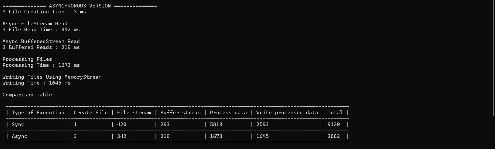

# Asynchronous Large File Processing with FileStream, BufferedStream, and MemoryStream

## Overview

This task extends the large file processing application by introducing asynchronous file operations using the asynchronous APIs provided by .NET streams. The application generates large data files, processes them efficiently, and supports concurrent processing of multiple files without blocking application threads.

The primary objective is to compare synchronous and asynchronous stream operations and demonstrate how asynchronous programming improves scalability and responsiveness under heavy workloads.

---

# Objectives

The application performs the following tasks:

1. Generate large data files asynchronously.
2. Read files asynchronously using `FileStream`.
3. Read files asynchronously using `BufferedStream`.
4. Process file contents asynchronously.
5. Write processed data asynchronously using `MemoryStream`.
6. Process multiple files concurrently.
7. Compare synchronous and asynchronous performance.

---

# Why Asynchronous File Processing?

Traditional synchronous file operations block the current thread until the operation completes.

```text
Request
   ↓
Read File
   ↓
Thread Blocked
   ↓
Continue Execution
```

With asynchronous operations:

```text
Request
   ↓
Read File Async
   ↓
Thread Released
   ↓
Other Work Executes
   ↓
Operation Completes
```

This approach allows better utilization of system resources and improves performance when handling multiple files simultaneously.

---

# Application Workflow

```text
Generate Large Files
          ↓
Read FileStream Async
          ↓
Read BufferedStream Async
          ↓
Measure Performance
          ↓
Process Data Async
          ↓
Write Data Async
          ↓
Process Multiple Files Concurrently
```

---

# Asynchronous File Generation

## Purpose

Generate large weather data files using asynchronous write operations.

### Implementation

```csharp
private async Task GenerateFileAsync(
    string path,
    int recordCount)
```

### Features

- Uses asynchronous `FileStream`.
- Uses asynchronous `StreamWriter`.
- Reduces thread blocking during file creation.
- Supports generation of very large files.

### Sample Record

```text
weather,data,24.5,humidity,70,pressure,1013
```

### Benefits

- Improved scalability.
- Non-blocking write operations.
- Better responsiveness during file generation.

---

# Asynchronous Reading with FileStream

## Purpose

Measure the time required to read a large file using asynchronous `FileStream`.

### Implementation

```csharp
private async Task<long> ReadWithFileStreamAsync(
    string path)
```

### Operation Flow

```text
Disk
  ↓
FileStream
  ↓
Buffer
  ↓
Application
```

### Key Features

- Uses `ReadAsync()`.
- Reads data in chunks.
- Measures total read duration using `Stopwatch`.

### Benefits

- Prevents thread blocking.
- Supports concurrent file reads.
- Improves scalability in I/O-heavy workloads.

---

# Asynchronous Reading with BufferedStream

## Purpose

Improve reading performance by combining buffering with asynchronous operations.

### Implementation

```csharp
private async Task<long> ReadWithBufferedStreamAsync(
    string path)
```

### Architecture

```text
Application
      ↓
BufferedStream
      ↓
FileStream
      ↓
Disk
```

### Features

- Uses internal buffering.
- Uses asynchronous reads.
- Reduces physical disk access.

### Benefits

- Fewer I/O operations.
- Improved throughput.
- Better performance for large files.

---

# Comparing FileStream and BufferedStream

## FileStream

### Advantages

- Direct disk access.
- Simple implementation.
- Suitable for most scenarios.

### Disadvantages

- More frequent disk reads.
- Lower throughput compared to buffered operations.

---

## BufferedStream

### Advantages

- Reduces disk I/O.
- Larger internal buffer.
- Better performance on large files.

### Disadvantages

- Additional memory allocation.

---

# Asynchronous Data Processing

## Purpose

Transform file contents without loading the entire file into memory.

### Processing Rule

Convert all text to uppercase.

### Implementation

```csharp
private async Task ProcessDataAsync(
    string inputPath,
    string outputPath)
```

### Example

#### Input

```text
weather,data,24.5,humidity,70,pressure,1013
```

#### Output

```text
WEATHER,DATA,24.5,HUMIDITY,70,PRESSURE,1013
```

### Features

- Reads data asynchronously.
- Processes data in chunks.
- Writes output asynchronously.

### Benefits

- Memory efficient.
- Suitable for large files.
- Non-blocking processing pipeline.

---

# Asynchronous Writing Using MemoryStream

## Purpose

Buffer processed data in memory before writing to the destination file.

### Implementation

```csharp
private async Task WriteProcessedDataAsync(
    string sourceFile,
    string destinationFile)
```

### Workflow

```text
Source File
      ↓
MemoryStream
      ↓
Destination File
```

### Features

- Uses `CopyToAsync()`.
- Uses asynchronous `FileStream`.
- Supports large data transfers.

### Benefits

- Improves responsiveness.
- Demonstrates asynchronous memory buffering.
- Reduces blocking during write operations.

---

# Concurrent File Processing

## Purpose

Process multiple files simultaneously.

### Example

```csharp
await Task.WhenAll(
    ProcessDataAsync("File1.txt", "File1_Output.txt"),
    ProcessDataAsync("File2.txt", "File2_Output.txt"),
    ProcessDataAsync("File3.txt", "File3_Output.txt")
);
```

### Execution Flow

```text
File 1 ─┐
         │
File 2 ──┼──► Concurrent Execution
         │
File 3 ─┘
```

### Benefits

- Multiple files processed simultaneously.
- Better CPU and I/O utilization.
- Reduced overall execution time.

---

# Performance Testing

## Test Scenario

The same workload is executed using both implementations.

### Test Configuration

- Multiple large files
- Approximately 1 GB per file
- Read, process, and write operations
- Execution time measured using `Stopwatch`

---

# Synchronous Execution

```text
File 1 → Complete
File 2 → Complete
File 3 → Complete
```

### Characteristics

- Operations execute sequentially.
- Threads remain blocked during I/O.
- Lower scalability.

---

# Asynchronous Execution

```text
File 1 ─┐
File 2 ─┼── Running Together
File 3 ─┘
```

### Characteristics

- Non-blocking operations.
- Concurrent execution.
- Better resource utilization.

---

# Expected Performance Results

### Benchmark



### Observations

- Reduced overall execution time.
- Better responsiveness.
- Improved scalability.
- More efficient handling of concurrent workloads.

Actual results vary depending on:

- CPU speed
- Available memory
- SSD/HDD performance
- Operating system caching
- Number of concurrent files

---

# Stream Comparison

| Stream Type | Purpose | Async Support | Primary Benefit |
|------------|---------|---------------|----------------|
| FileStream | Direct file access | Yes | Efficient file I/O |
| BufferedStream | Buffered file access | Yes | Reduced disk operations |
| MemoryStream | In-memory buffering | Yes | Fast temporary storage |

---

# Advantages of the Asynchronous Solution

## Improved Scalability

Multiple file operations can execute simultaneously without blocking threads.

### Example

```text
100 Files
   ↓
Task.WhenAll()
   ↓
Concurrent Processing
```

---

## Better Resource Utilization

The operating system can utilize CPU and storage resources more effectively while waiting for I/O operations.

---

## Improved Responsiveness

The main application thread remains available for:

- User interface updates
- Additional processing
- New requests

---

## Reduced Waiting Time

While one file operation waits for disk access, other operations can continue executing.

---

# Learning Outcomes

After completing this task, you will understand:

- Asynchronous programming with `async` and `await`.
- Asynchronous file operations using `FileStream`.
- Asynchronous buffering with `BufferedStream`.
- Asynchronous memory operations using `MemoryStream`.
- Processing large files efficiently.
- Concurrent execution using `Task.WhenAll`.
- Performance measurement using `Stopwatch`.
- Differences between synchronous and asynchronous I/O.
- Techniques for building scalable file-processing applications.

---

# Conclusion

This project demonstrates how asynchronous stream operations can significantly improve the scalability and responsiveness of large-file processing applications. By leveraging asynchronous `FileStream`, `BufferedStream`, and `MemoryStream` APIs, the application can read, process, and write large files without blocking threads. Combined with concurrent file processing through `Task.WhenAll`, the asynchronous implementation handles high workloads more efficiently and provides better overall performance compared to the synchronous version.