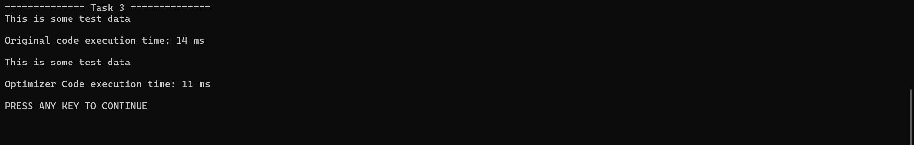

# Task 3 - MemoryStream and FileStream Operations

## Overview

This task demonstrates how to use `MemoryStream` and `FileStream` in C# to write text data to memory, save it to a file, and read it back. Two implementations are provided:

- **RunOriginalCode()**: Starter implementation.
- **Run()**: Optimized implementation with improved readability, maintainability, and stream handling.

---

## Objective

The goal of this task is to:

1. Store text data in memory using a `MemoryStream`.
2. Persist the in-memory data to a file using a `FileStream`.
3. Read the stored data back from the file.
4. Display the file contents in the console.

---

## Original Implementation

### Description

The original implementation:

1. Converts a string into a byte array using **ASCII encoding**.
2. Writes the byte array to a `MemoryStream`.
3. Copies the memory stream content to a file (`file5.txt`) using `ToArray()`.
4. Reads the file using a `FileStream`.
5. Displays the content by converting each byte individually into a character.

### Key Features

- Uses `Encoding.ASCII`
- Reads and processes bytes manually
- Demonstrates fundamental stream operations
- Uses a buffer for reading file data

### Sample Code

```csharp
byte[] buffer = Encoding.ASCII.GetBytes(data);
memoryStream.Write(buffer, 0, buffer.Length);
```

```csharp
for (int index = 0; index < bytesRead; index++)
{
    Console.Write((char)buffer[index]);
}
```

### Advantages

- Easy to understand for beginners.
- Demonstrates low-level byte processing.

### Limitations

- ASCII supports a limited character set.
- Requires manual byte-to-character conversion.
- Uses an intermediate byte array when copying data to a file.
- Less maintainable for larger applications.

---

## Optimized Implementation

### Description

The optimized implementation performs the same operations while improving code readability, maintainability, and stream handling.

### Improvements

### 1. UTF-8 Encoding

The optimized version uses UTF-8 instead of ASCII.

```csharp
byte[] buffer = Encoding.UTF8.GetBytes(data);
```

#### Benefits

- Supports international and Unicode characters.
- Industry-standard encoding format.
- Better compatibility across systems and platforms.

---

### 2. Direct Stream-to-Stream Copying

Instead of converting the `MemoryStream` into a byte array using `ToArray()`, the optimized version copies the stream directly to the file.

```csharp
using (MemoryStream memoryStream = new ())
{
    byte[] buffer = Encoding.UTF8.GetBytes(data);
    memoryStream.Write(buffer, 0, buffer.Length);

    memoryStream.Position = 0;

    using (FileStream fileStream = new (path, FileMode.Create))
    {
        memoryStream.WriteTo(fileStream);
    }
}
```

#### Benefits

- Eliminates the need for an additional temporary byte array.
- Reduces memory overhead.
- Makes the intent of copying one stream to another clearer.
- Provides a cleaner and more maintainable implementation.

---

### 3. Simplified String Output

The optimized version converts read bytes directly into a string.

```csharp
string chunk = Encoding.UTF8.GetString(buffer);

Console.WriteLine(chunk);
```

#### Benefits

- Removes manual byte-by-byte conversion.
- Improves readability.
- Simplifies maintenance.


---

## Comparison

| Aspect | Original Code | Optimized Code |
|----------|-------------|---------------|
| Encoding | ASCII | UTF-8 |
| Stream Copy Method | `ToArray()` + `Write()` | `WriteTo()` |
| Character Processing | Manual byte conversion | Direct string conversion |
| Readability | Good | Better |
| Memory Efficiency | Moderate | Improved |
| Unicode Support | Limited | Full UTF-8 Support |
| Modern C# Features | No | Yes |
| Maintainability | Moderate | High |


---

## Concepts Covered

- MemoryStream
- FileStream
- Stream Writing
- Stream Reading
- Stream-to-Stream Copying
- Buffer Management
- ASCII Encoding
- UTF-8 Encoding
- Resource Management with `using`
- Modern C# Syntax

---
## Output



## Learning Outcomes

After completing this task, you will be able to:

- Store data temporarily in memory using a `MemoryStream`.
- Write in-memory data to a file using a `FileStream`.
- Read file contents using buffered stream operations.
- Understand the differences between ASCII and UTF-8 encoding.
- Use `WriteTo()` for efficient stream-to-stream copying.
- Write cleaner, more maintainable code using modern C# practices.

---

## Conclusion

Both implementations successfully demonstrate how to work with memory and file streams in .NET. The optimized version enhances the original code by adopting UTF-8 encoding, utilizing direct stream-to-stream copying through `WriteTo()`, simplifying text output, and leveraging modern C# syntax. These improvements result in cleaner, more maintainable, and more efficient code while preserving the original functionality.