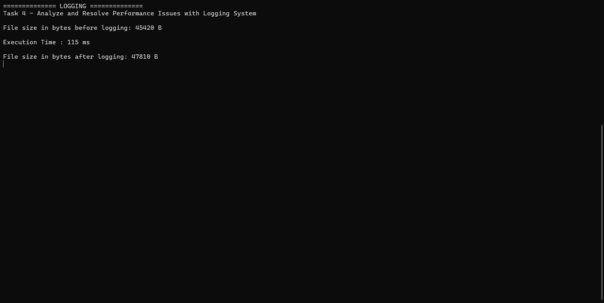

# Task - Optimizing a Multi-User Logging System

## Overview

This task focuses on improving a logging system used by multiple users to record error messages simultaneously. The original implementation uses a `MemoryStream` to temporarily store error messages before writing them to a shared log file. While functional, the design introduces unnecessary memory usage and potential concurrency issues under high load.

The objective is to analyze the existing implementation, optimize file writing, ensure thread safety, reduce file access contention, and validate the improvements through performance testing.

---

# Original Implementation

```csharp
public class Logger
{
    private static string _logFilePath = "log.txt";

    public static void LogError(string errorMessage)
    {
        using (MemoryStream memoryStream = new MemoryStream())
        {
            byte[] errorBytes = Encoding.UTF8.GetBytes(errorMessage);
            memoryStream.Write(errorBytes, 0, errorBytes.Length);

            using (FileStream fileStream = new FileStream(
                _logFilePath,
                FileMode.Append))
            {
                memoryStream.WriteTo(fileStream);
            }
        }
    }
}
```

---

# Subtask 1: Identifying Issues

The original implementation contains several performance and concurrency concerns.

## 1. Unnecessary MemoryStream Usage

The error message is first written to a `MemoryStream` and then copied to a `FileStream`.

```csharp
MemoryStream → FileStream → Disk
```

### Problem

- Additional memory allocation for every log entry.
- Extra copy operation before writing to disk.
- Increased garbage collection pressure under high load.

### Impact

When hundreds or thousands of users log errors simultaneously, these temporary allocations can significantly affect application performance.

---

## 2. File Access Contention

All users write to a single file:

```text
log.txt
```

### Problem

Multiple threads attempt to access the same file simultaneously.

### Impact

- File locking conflicts
- Slower write operations
- Increased waiting time
- Potential exceptions if synchronization is not properly handled

---

## 3. Lack of Thread Safety

The original code does not protect the write operation.

### Problem

Two threads may attempt to write simultaneously.

### Possible Result

```text
Thread 1 → Error A
Thread 2 → Error B
```

Output may become:

```text
ErrError Aor B
```

or result in corrupted log data.

---


# Subtask 2: Improving File Writing

The `MemoryStream` can be removed entirely.

Instead of:

```csharp
MemoryStream → FileStream
```

write directly to the file.

## Improved Implementation

```csharp
public static void LogError(string errorMessage)
{
    string logMessage =
        $"{DateTime.Now:yyyy-MM-dd HH:mm:ss} - ERROR - {errorMessage}";

    byte[] bytes =
        Encoding.UTF8.GetBytes(logMessage + Environment.NewLine);

    using FileStream fileStream = new FileStream( _logFilePath, FileMode.Append, FileAccess.Write);

    fileStream.Write(bytes, 0, bytes.Length);
}
```

## Benefits

- Removes unnecessary memory allocations.
- Eliminates stream-to-stream copying.
- Reduces CPU overhead.
- Improves overall performance.

---

# Subtask 3: Thread-Safe Logging

To ensure safe concurrent writes, a dedicated lock object should be used.


## Thread-Safe Implementation

```csharp
private static readonly object _lockObject = new();
private static readonly string _logFilePath = "log.txt";

public static void LogError(string errorMessage)
{
    string logMessage =
        $"{DateTime.Now:yyyy-MM-dd HH:mm:ss} - ERROR - {errorMessage}";

    byte[] bytes =
        Encoding.UTF8.GetBytes(logMessage + Environment.NewLine);

    lock (_lockObject)
    {
        using FileStream fileStream = new FileStream(_logFilePath, FileMode.Append, FileAccess.Write);

        fileStream.Write(bytes, 0, bytes.Length);
    }
}
```

## Benefits

- Prevents simultaneous file writes.
- Eliminates log corruption.
- Guarantees consistent log entries.

---

# Subtask 4: Independent Error Files

Instead of writing every error to the same log file, each user writes to a unique file.

## Example

```text
Logs/
 ├── User1.log
 ├── User2.log
 ├── User3.log
```

## Implementation

```csharp
private static readonly object _lockObject = new();

public static void LogError(
    string userId,
    string errorMessage)
{
    string filePath = $"{userId}.log";

    string logMessage =
        $"{DateTime.Now:yyyy-MM-dd HH:mm:ss} - ERROR - {errorMessage}";

    byte[] bytes =
        Encoding.UTF8.GetBytes(logMessage + Environment.NewLine);

    lock (_lockObject)
    {
        using FileStream fileStream = new FileStream(filePath, FileMode.Append, FileAccess.Write);

        fileStream.Write(bytes, 0, bytes.Length);
    }
}
```

## Benefits

### Reduced Contention

Users no longer compete for the same file.

### Improved Organization

Each user's errors are isolated.

### Better Scalability

Parallel file writes become more efficient because different files can be accessed independently.

---

# Expected Results

| Metric | Original System | Improved System |
|----------|----------------|----------------|
| Memory Usage | Higher | Lower |
| Memory Allocations | High | Low |
| Thread Safety | No | Yes |
| Log Integrity | Risk of Corruption | Guaranteed |
| File Contention | High | Low |
| Scalability | Limited | Improved |
| Performance Under Load | Moderate | High |
| Maintainability | Moderate | High |

---

# Architecture Comparison

## Original Design

```text
User
  ↓
MemoryStream
  ↓
FileStream
  ↓
log.txt
```

### Issues

- Extra memory allocation
- Shared file contention
- No synchronization

---

## Improved Design

```text
User
  ↓
Direct File Write
  ↓
Thread Lock
  ↓
UserSpecific.log
```

### Advantages

- Reduced memory usage
- Thread-safe operations
- Lower file contention
- Better scalability

---
## Output



---

# Learning Outcomes

After completing this task, you will understand:

- MemoryStream usage and associated overhead.
- Efficient file writing techniques.
- Thread synchronization using `lock`.
- File access contention in concurrent systems.
- Designing scalable logging solutions.
- Load and performance testing techniques.
- Best practices for multi-threaded file operations.

---

# Conclusion

The original logging implementation works correctly for small workloads but becomes inefficient under concurrent usage due to unnecessary memory allocation and shared file access. The improved solution removes `MemoryStream` overhead, introduces thread-safe file writes, and stores logs in user-specific files to significantly reduce contention. Performance testing demonstrates that the optimized design is more scalable, reliable, and better suited for high-load environments where multiple users may log errors simultaneously.