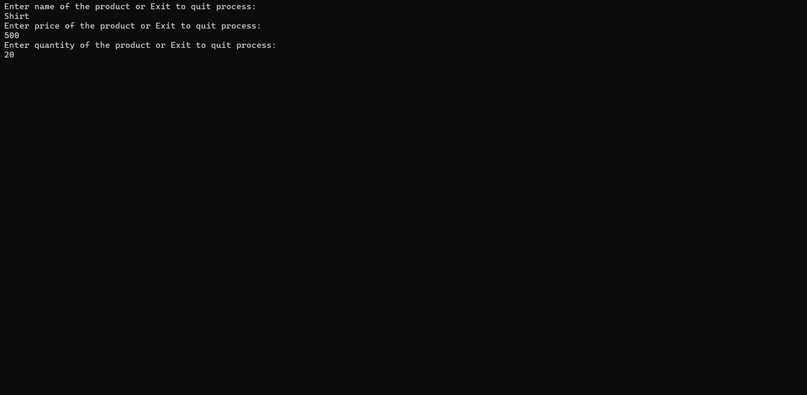
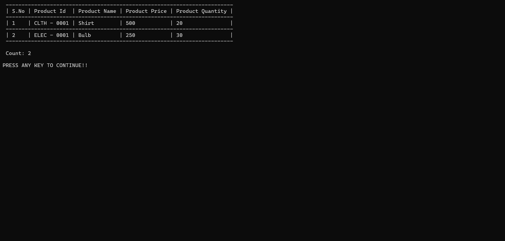
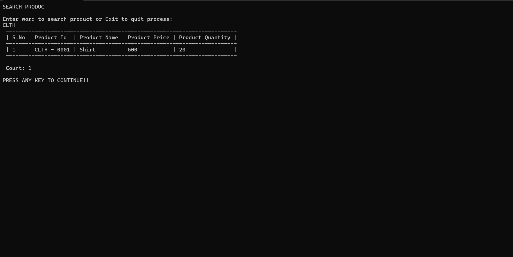
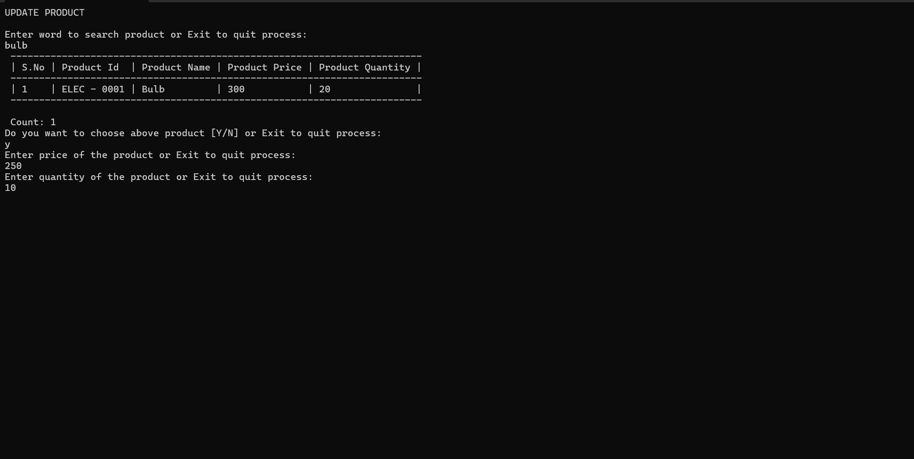
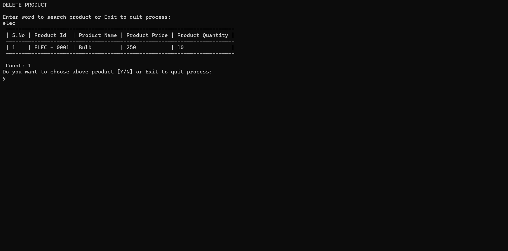
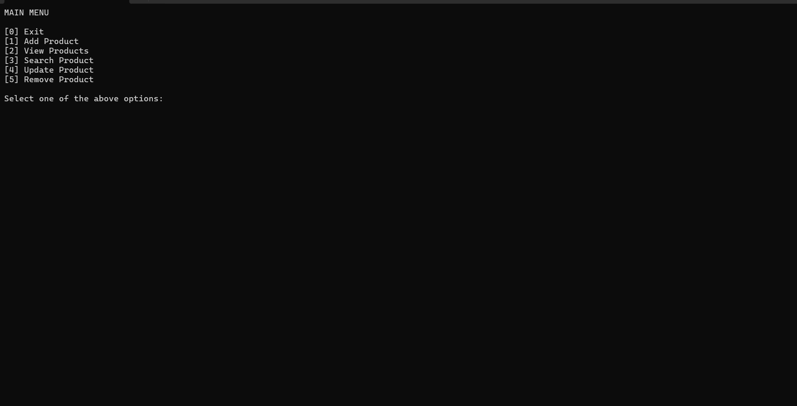

# Inventory Management System

## Overview

The Inventory Management System is a console-based C# application designed to manage product inventory efficiently using Object-Oriented Programming principles and a layered architecture.

The application allows users to:

- Add new products
- View all products
- Search products by ID or Name
- Update product details
- Delete products
- Manage inventory through an interactive console menu

All data is maintained in-memory during application runtime and is not persisted to a database or file.

---

# Features

## Product Management

Each product contains:

- Product ID
- Product Name
- Product Price
- Quantity In Stock

### Supported Operations

| Operation | Description |
|------------|------------|
| Add Product | Add a new product to inventory |
| View Products | Display all products |
| Search Product | Search by Product ID or Product Name |
| Update Product | Update Price and Quantity only |
| Delete Product | Remove product from inventory |
| Exit | Close application |

---

# Business Rules


## Product Name

- Cannot be empty
- Cannot contain only whitespaces
- Cannot be modified after creation


## Product Price

- Must be a positve number
- Decimal values are allowed


## Quantity In Stock

- Must be zero or greater
- Negative values are not allowed


---

# Functionalities

## 1. Add Product

Allows users to create a new product.



### Validation

- Empty Product Names not allowed
- Price cannot be negative
- Quantity cannot be negative


---

## 2. View Products

Displays all products currently available in inventory.

### Special Feature

Products are automatically displayed in ascending order of Product ID.



---

## 3. Search Product

Search products using:

### Search by Product ID or Product Name

```text
Enter Product ID: 101
```

### Output

Search results are displayed using ConsoleTable.



If a product is not found:


---

## 4. Update Product

Allows modification of selected product details.

### Editable Fields

1. Price

2. Quantity

### Non-Editable Fields

1.  Product ID

2. Product Name

The Product ID and Product Name serve as product identifiers and therefore cannot be modified once created.



---

## 5. Delete Product

Allows removal of a product from inventory.


If product does not exist:



---

# Validation and Error Handling

The application implements comprehensive validation to ensure data integrity.

## Input Validation

The following validations are performed:


### Product Name

- Not null
- Not empty
- Not whitespace

### Price

- Numeric value
- Zero or greater

### Quantity

- Numeric value
- Zero or greater

---

## Exception Handling

The application uses try-catch blocks to handle unexpected runtime errors.

### Example

```csharp
try
{
    // Operation
}
catch(Exception ex)
{
    Console.WriteLine(ex.Message);
}
```

Handled scenarios include:

- Runtime exceptions

---

# Project Structure


```text
InventoryManager
│
├── Constants
│   └── ApplicationConstants.cs
│
├── Controller
│   ├── IController.cs
│   ├── InventoryController.cs
│   └── InventoryMenuController.cs
│
├── EnumConstants
│   └── MenuOptions.cs
│
├── Helper
│   └── Validation.cs
│
├── Models
│   └── Product.cs
│
├── Repository
│   ├── IRepository.cs
│   └── InventoryRepository.cs
│
├── Service
│   ├── IService.cs
│   └── InventoryService.cs
│
├── View
│   ├── DisplayEnum.cs
│   └── InventoryView.cs
│
└── Program.cs
```

### Folder Description

#### Constants
Contains application-wide constants such as validation messages, success messages, error messages, regex patterns, and menu labels.

#### Controller
Acts as an intermediary between the View and Service layers.

- **IController.cs** – Defines controller operations.
- **InventoryController.cs** – Handles inventory-related actions.
- **InventoryMenuController.cs** – Manages menu navigation and user choices.

#### EnumConstants
Contains enumerations used throughout the application.

- **MenuOptions.cs** – Menu options for inventory operations.

#### Helper
Contains reusable utility functions.

- **Validation.cs** – Handles input validation using regex and business rules.

#### Models
Contains application data models.

- **Product.cs** – Represents a 


---

# Layer Responsibilities

## Model Layer

### Product.cs

Represents inventory product information.

---

## Repository Layer

### InventoryRepository

Responsible for managing in-memory data storage.

Operations:

- Add Product
- Retrieve Products
- Update Product
- Delete Product
- Search Product

---

## Service Layer

### InventoryService

Contains business logic and validation rules.

Responsibilities:

- Product validation
- Duplicate ID checks
- Search handling
- Update rules
- Sorting logic

---

## Controller Layer

### InventoryController

Processes user requests and interacts with services.

### InventoryMenuController

Handles menu navigation and operation selection.

---

## View Layer

### InventoryView

Handles all console interactions.

Responsibilities:

- Display menus
- Display product information
- Display search results using ConsoleTable
- Display messages and errors

---

## Helper Layer

### Validation.cs

Reusable validation methods for:

- Integer values
- Decimal values
- String values
- Positive number validation

---

# Console Menu



---

# Technologies Used

- C#
- .NET Console Application
- Object-Oriented Programming (OOP)
- ConsoleTable Library
- Exception Handling
- In-Memory Data Storage

---

# How to Run

## Prerequisites

- .NET SDK 6.0 
-  Visual Studio Code

---


# Special Features

- Layered Architecture

- Full Input Validation

- ConsoleTable Output Formatting

- Automatic Sorting During View Operation

- Exception Handling

- User-Friendly Console Interface

- Product ID and Product Name Protected From Update

---

# Author
Diwas Thangarasu

Developed using C# and .NET Console Application following clean coding principles, separation of concerns, and object-oriented design practices.