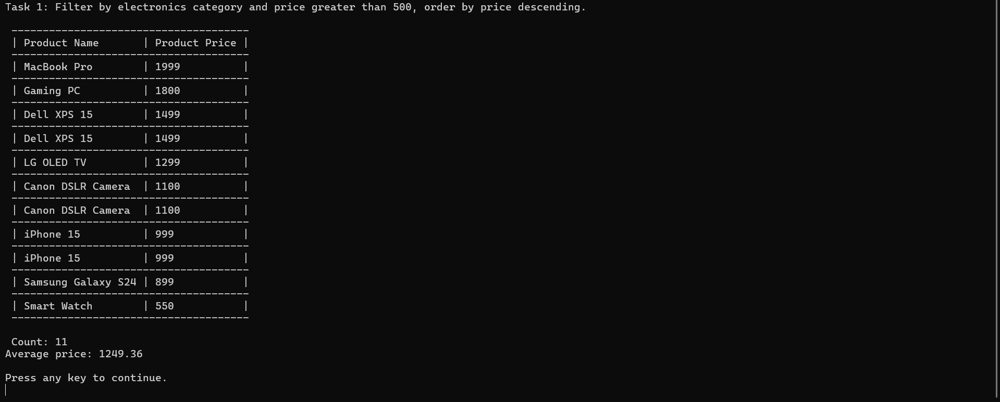
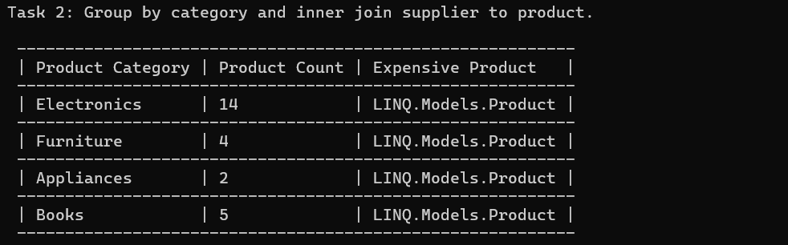
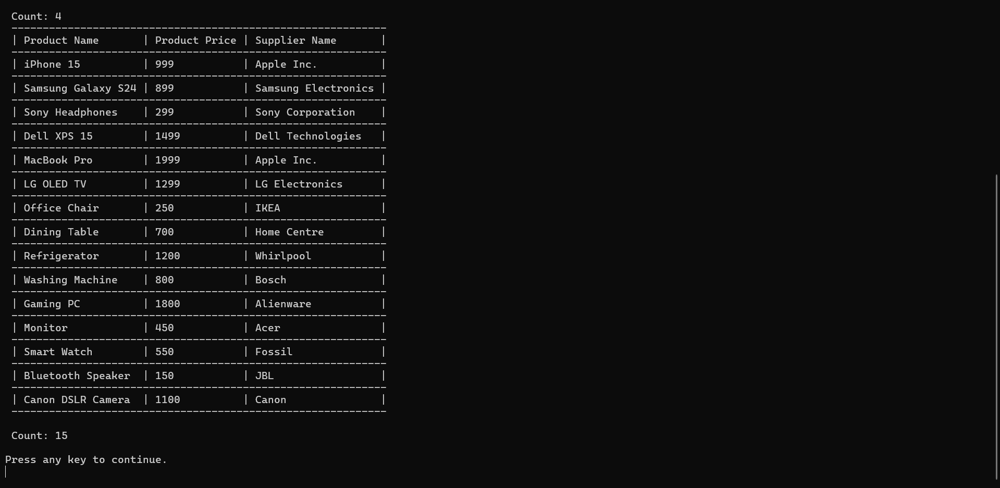
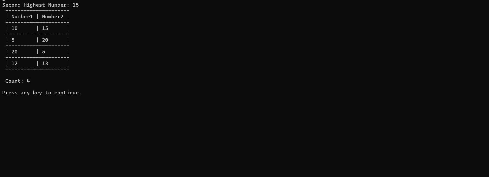
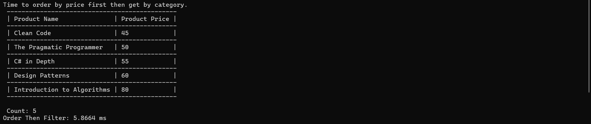
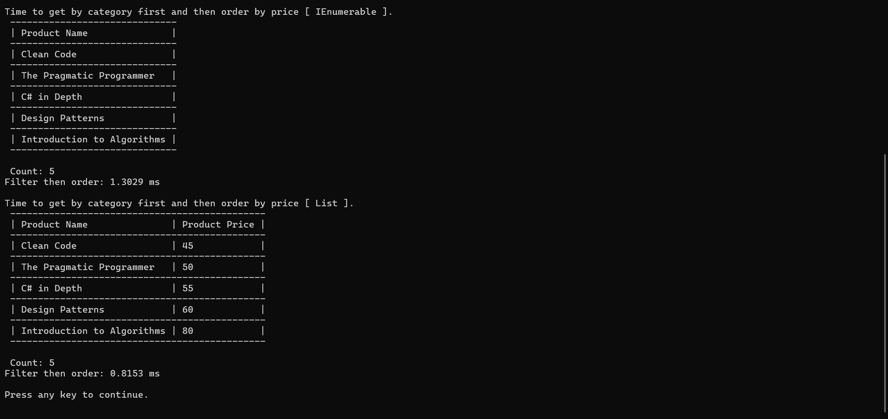
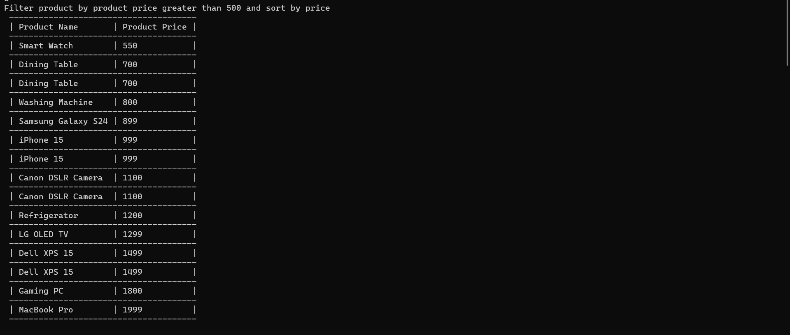
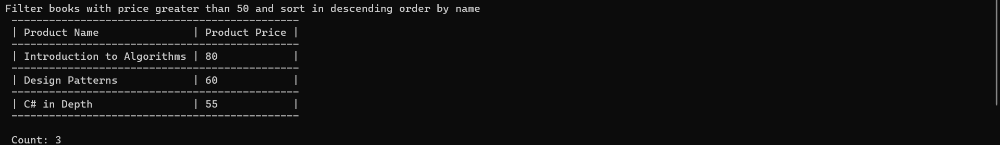
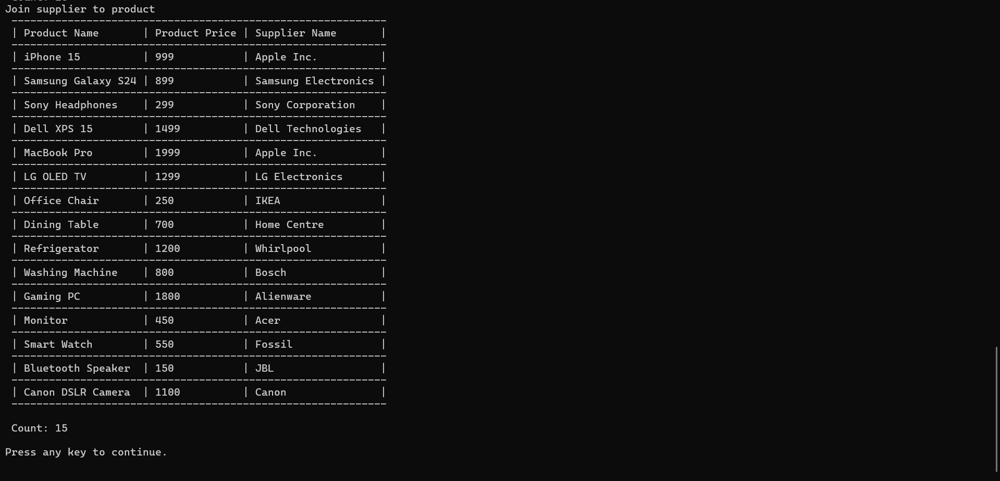

# LINQ Assignment - C#

## Overview

This project demonstrates the practical usage of **Language Integrated Query (LINQ)** in C#. The assignment covers everything from basic filtering and sorting operations to advanced grouping, joining, performance optimization, and building a custom LINQ Query Builder using the Fluent API pattern.

The solution is organized using a layered architecture consisting of Models, Repository, Services, Views, and utility classes to ensure maintainability and separation of concerns.


---

## Project Structure

```text
LINQ
│
├── Docs
│   └── Assets
│
├── Enums
│   └── MainMenu.cs
│
├── Models
│   ├── Product.cs
│   └── Supplier.cs
│
├── Repository
│   ├── ProductRepository.cs
│   └── SupplierRepository.cs
│
├── Service
│   ├── QueryBuilder.cs
│   ├── Task1.cs
│   ├── Task2.cs
│   ├── Task3.cs
│   ├── Task4.cs
│   └── Task5.cs
│
├── View
│   └── LinqView.cs
│
├── Program.cs
└── README.md
```

---

## Models

### Product

Represents a product in the inventory.

| Property | Type |
|-----------|------|
| ProductId | int |
| ProductName | string |
| Price | decimal |
| Category | string |

### Supplier

Represents supplier information.

| Property | Type |
|-----------|------|
| SupplierId | int |
| SupplierName | string |
| ProductId | int |

---

# Task 1: Basic LINQ Queries

### Objectives

Perform basic filtering, sorting, and aggregation using LINQ.

### Requirements

#### 1. Filter Electronics Products

Retrieve products that:

- Belong to the **Electronics** category.
- Have a price greater than **$500**.
- Select only:
  - ProductName
  - Price

#### 2. Sort Products

Sort the filtered result in:

- Descending order by price.

#### 3. Calculate Average Price

Calculate the average price of the filtered products.

### LINQ Concepts Covered

- Where()
- Select()
- OrderByDescending()
- Average()

### Output


---

# Task 2: Complex LINQ Queries

### Objectives

Perform grouping and joining operations.

### Requirements

#### 1. Group Products by Category

For each category:

- Count the total products.
- Identify the most expensive product.

#### 2. Inner Join Products and Suppliers

Match products with their suppliers using:

```csharp
Product.ProductId == Supplier.ProductId
```

### LINQ Concepts Covered

- GroupBy()
- Count()
- Max()
- OrderByDescending()
- Join()

### Output




---

# Task 3: LINQ to Objects

### Objectives

Use LINQ on in-memory collections.

### Requirements

#### 1. Find Second Highest Number

From an integer array:

- Remove duplicates.
- Sort descending.
- Retrieve the second highest value.

#### 2. Find Unique Pairs

Identify all unique pairs whose sum equals a user-defined target.

### LINQ Concepts Covered

- Distinct()
- OrderByDescending()
- Skip()
- Take()
- SelectMany()

### Output



---

# Task 4: Performance Considerations with LINQ

### Objectives

Compare standard and optimized LINQ queries.

### Requirements

#### Query 1

Retrieve all books and sort by price.

```csharp
products
    .Where(p => p.Category == "Books")
    .OrderBy(p => p.Price);
```

#### Query 2 (Optimized)

Use deferred execution and avoid unnecessary enumerations.

### LINQ Concepts Covered

- Deferred Execution
- Immediate Execution
- IEnumerable
- Performance Optimization

### Outcome




---

# Task 5: Query Builder (Bonus Challenge)

## Objective

Create a reusable LINQ Query Builder using the Fluent API Pattern.

---

### QueryBuilder Features

#### Filter

Adds filtering conditions.

```csharp
.Filter(x => x.Price > 500)
```

#### SortBy

Adds sorting conditions.

```csharp
.SortBy(x => x.Price)
```

#### Join

Adds join operations between collections.

```csharp
.Join(...)
```

#### Execute

Executes the constructed query.

```csharp
.Execute()
```

---

### Fluent API Example

```csharp
var results = new QueryBuilder<Product>(products)
                    .Filter(p => p.Category == "Electronics")
                    .Filter(p => p.Price > 500)
                    .SortBy(p => p.Price)
                    .Execute();
```

---

### Concepts Covered

- Fluent API Design
- Generic Classes
- Lambda Expressions
- Expression Trees
- Method Chaining
- Reusable Query Construction

### Expected Outcome






---

## Repository Layer

### ProductRepository

Responsible for:

- Managing product collections.
- Providing product data to services.

### SupplierRepository

Responsible for:

- Managing supplier collections.
- Providing supplier data to services.

---

## Service Layer

### Task1.cs

Implements basic LINQ operations:

- Filtering
- Sorting
- Aggregation

### Task2.cs

Implements:

- Grouping
- Joining

### Task3.cs

Implements LINQ to Objects operations.

### Task4.cs

Demonstrates LINQ performance optimization techniques.

### Task5.cs

Demonstrates custom Query Builder implementation using Fluent API principles.

### QueryBuilder.cs

Reusable utility for constructing dynamic LINQ queries.

---

## View Layer

### LinqView.cs

Responsible for:

- Displaying menus.
- Showing results.
- Handling user interaction.

---

## Key LINQ Methods Used

- Where()
- Select()
- OrderBy()
- OrderByDescending()
- GroupBy()
- Join()
- Average()
- Count()
- Max()
- Distinct()
- Skip()
- Take()
- SelectMany()


## Author

**Diwas Thangarasu**

C# LINQ Assignment Project demonstrating basic to advanced LINQ capabilities, performance optimization, and Fluent API query building.