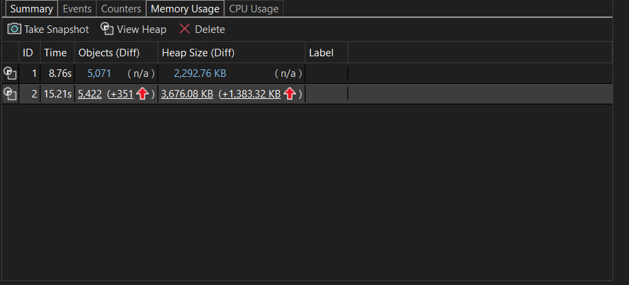
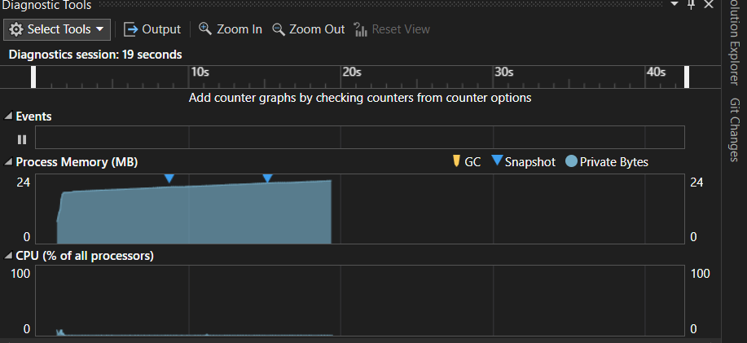
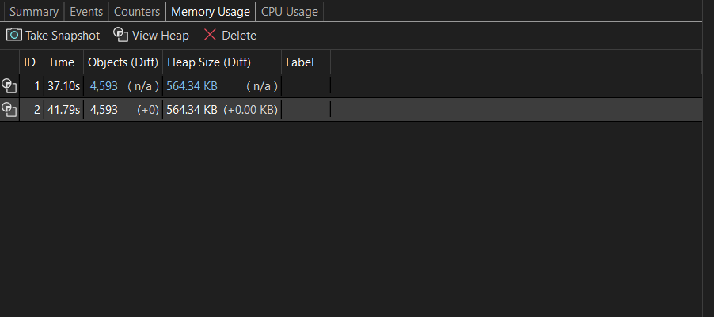
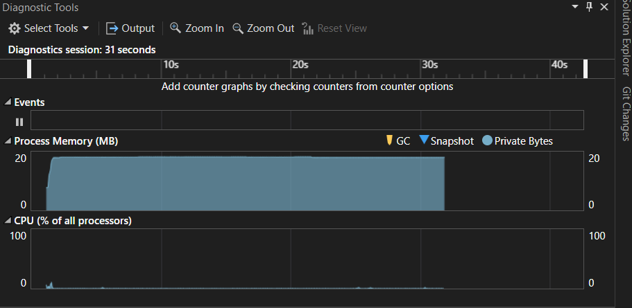

# C# Memory Management Assignment

## Introduction

This assignment focuses on understanding memory management in C#, identifying memory-related issues, applying optimization techniques, and using Visual Studio Diagnostic Tools to analyze application memory usage.

The provided application demonstrates how improper memory allocation can lead to excessive memory consumption. Using memory profiling tools, we can diagnose the issue, implement improvements, and verify the results.

---

# Task 1: Detecting and Diagnosing Memory Issues

## Objective

Identify and diagnose memory issues in the provided C# application.

---

## Original Code

```csharp
public class Program
{
    public static void Main()
    {
        MemoryEater memoryEater = new ();
        memoryEater.Allocate();

        Console.ReadKey();
    }
}

internal class MemoryEater
{
    private List<int[]> _memAlloc = new List<int[]>();

    public void Allocate()
    {
        while (true)
        {
            this._memAlloc.Add(new int[1000]);

            Thread.Sleep(10);
        }
    }
}
```

---

## Issue Analysis

The application continuously allocates memory by creating a new integer array during each loop iteration:

```csharp
new int[1000]
```

Each newly created array is stored in the `_memAlloc` list:

```csharp
_memAlloc.Add(new int[1000]);
```

Since the list retains references to all allocated arrays, the Garbage Collector (GC) cannot reclaim the memory.

### Root Cause

The loop:

```csharp
while (true)
{
    _memAlloc.Add(new int[1000]);
}
```

creates:

- Infinite allocations
- Continuous memory growth
- Increased GC pressure
- Potential OutOfMemoryException

Although the Garbage Collector runs periodically, it cannot clean up objects that are still referenced by `_memAlloc`.

---

## Memory Profiling Using Visual Studio Diagnostic Tools




---

## Profiling Results (Before Optimization)

### Observations

From the Diagnostic Tools screenshot:

- Memory usage continuously increased over time.
- Process memory grew from approximately **8 MB to 24 MB**.
- Memory graph showed a clear upward trend.
- Objects accumulated because references remained inside the list.

### Conclusion

The application exhibits unbounded memory growth due to continuous allocation and retention of arrays.

---

# Task 2: Implementing Memory Management Best Practices

## Optimized Code

```csharp
public class Program
{
    public static void Main()
    {
        MemoryEater memoryEater = new ();
        memoryEater.Allocate();

        Console.ReadKey();
    }
}

internal class MemoryEater
{
    public void Allocate()
    {
        List<int[]> memAlloc = new ();

        int[] list = new int[1000];

        while (true)
        {
            memAlloc.Add(list);

            Thread.Sleep(10);
        }
    }
}
```

---

## Optimization Explanation

### Before

A new array was allocated every iteration:

```csharp
_memAlloc.Add(new int[1000]);
```

### After

Only one array is created:

```csharp
int[] list = new int[1000];
```

The same array reference is reused:

```csharp
memAlloc.Add(list);
```

This eliminates repeated array allocations and significantly reduces memory consumption.


---

# Task 3: Memory Profiling After Optimization
---

## Memory Profiling Using Visual Studio Diagnostic Tools




---
## Profiling Results (After Optimization)

### Observations

From the optimized application's Diagnostic Tools screenshot:

- Memory usage stabilized around **20 MB**.
- No continuous upward growth trend.
- GC activity remained minimal.
- Memory remained relatively constant throughout execution.

### Why Did Memory Usage Improve?

The optimized version allocates only one array:

```csharp
int[] list = new int[1000];
```

Instead of creating thousands of arrays.

As a result:

- Fewer allocations occur.
- Less garbage is generated.
- Reduced GC pressure.
- Stable memory consumption.

---

# Memory Comparison

| Metric | Before Optimization | After Optimization |
|----------|----------|----------|
| Array Allocations | Continuous | One-Time |
| Memory Growth | Increasing | Stable |
| GC Pressure | High | Low |
| Memory Consumption | Growing | Nearly Constant |
| Risk of OutOfMemoryException | High | Very Low |
| Performance | Degrades Over Time | Consistent |

---

# Expected Outcomes

## Task 1

 - Identified memory issue caused by continuous allocation and retention of arrays.

 - Diagnosed the problem using Visual Studio Diagnostic Tools.

---

## Task 2

 - Optimized the code by eliminating repeated array allocations.

 - Applied memory management best practices.

---

## Task 3

 - Profiled memory usage before and after optimization.

 - Verified memory stabilization after changes.

 - Demonstrated how Visual Studio Diagnostic Tools assist in identifying and resolving memory-related issues.

---

# Conclusion

The original implementation continuously created new arrays and stored them in a growing list, leading to unbounded memory growth. Using Visual Studio Diagnostic Tools, the issue was identified as object retention caused by persistent references inside the collection.

The optimized implementation reused a single array instance, significantly reducing allocations and stabilizing memory consumption. This exercise demonstrates how proper memory management techniques, combined with profiling tools, can greatly improve the efficiency and reliability of C# applications.

### Key Takeaway

Effective memory management is not just about writing correct code; it is about ensuring that objects are allocated, used, and released efficiently. Memory profiling tools such as Visual Studio Diagnostic Tools play a crucial role in identifying bottlenecks and validating optimization efforts.