# OOPS Console Application

## Overview

This project is a **C# Console Application** developed to demonstrate the core concepts of **Object-Oriented Programming (OOP)** using:

- Abstraction

The application consists of three independent modules:

1. Shape Hierarchy
2. Employee Hierarchy
3. Bank Management System

The project follows a layered architecture where:

- **Models** contain abstract base classes.
- **Services** contain derived classes and business logic.
- **Repository** handles data storage and retrieval.
- **View** handles user interactions.
- **Helper** contains validation methods.
- **Constants** and **EnumConstants** contain reusable application constants and menu contents.

---

#  Project Structure

```text
src
└── OOPS
    │
    ├── Constants
    │   ├── BankConstants.cs
    │   ├── MessageConstants.cs
    │   └── RegexPattern.cs
    │
    ├── EnumConstants
    │   ├── BankAccountContent.cs
    │   └── MenuContent.cs
    │
    ├── Helper
    │   └── Validation.cs
    │
    ├── Models
    │   ├── Shape.cs
    │   ├── Employee.cs
    │   └── BankAccount.cs
    │
    ├── Repository
    │   └── BankSystemRepo.cs
    │
    ├── Services
    │   │
    │   ├── ShapeHierarchy
    │   │   ├── Circle.cs
    │   │   └── RectangleShape.cs
    │   │
    │   ├── EmployeeHierarchy
    │   │   ├── Developer.cs
    │   │   └── Manager.cs
    │   │
    │   └── BankSystem
    │       ├── BankServices.cs
    │       ├── SavingsAccount.cs
    │       └── CheckingAccount.cs
    │
    ├── View
    │   ├── MainMenu.cs
    │   ├── ShapeHierarchy.cs
    │   ├── EmployeeHierarchy.cs
    │   ├── BankSystem.cs
    │   ├── DisplayEnum.cs
    │   └── ValidInput.cs
    │
    └── Program.cs
```

---

#  Architecture

The application follows a layered design.

```text
             ┌─────────────┐
             │    View     │
             └──────┬──────┘
                    │
                    ▼
             ┌─────────────┐
             │  Services   │
             └──────┬──────┘
                    │
         ┌──────────┴──────────┐
         ▼                     ▼
    Models                Repository
         │
         ▼
     Abstract
      Classes
```

---

#  OOP Concepts Implemented

## 1. Abstraction

Abstract classes are used to define common properties and behaviors while hiding implementation details.

### Abstract Models

- Shape
- Employee
- BankAccount

These classes cannot be instantiated directly.

Derived classes inherit common functionality from their respective abstract base classes.

```text
Shape
├── Circle
└── RectangleShape

Employee
├── Developer
└── Manager

BankAccount
├── SavingsAccount
└── CheckingAccount
```


Abstract methods are overridden by derived classes.

Examples:

```csharp
CalculateArea()
CalculateBonus()
Deposit()
Withdraw()
PrintDetails()
```

The same method behaves differently based on the object type.


Object data is protected within classes using properties and controlled through methods.

Examples:

```csharp
Color
Name
Salary
Balance
AccountNumber
```

---

#  Shape Hierarchy Module

## Abstract Class: Shape

The Shape class serves as the base class for all shapes.

### Properties

| Property | Type |
|-----------|------|
| Color | string |

### Methods

```csharp
double CalculateArea();
string PrintDetails();
```

### Responsibilities

- Store shape color.
- Define area calculation contract.
- Display shape information.

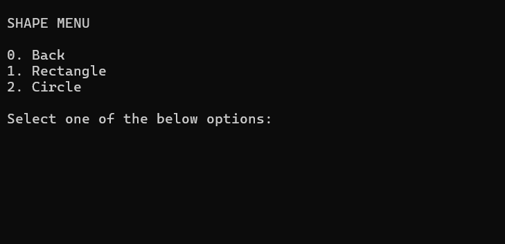

---

## Derived Class: Circle

### Additional Properties

| Property | Type |
|-----------|------|
| Radius | double |

### Methods

```csharp
CalculateArea()
PrintDetails()
```

### Formula

```text
Area = π × Radius²
```

### Example

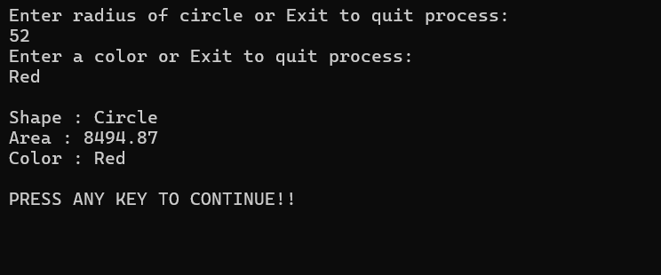

---

## Derived Class: RectangleShape

### Additional Properties

| Property | Type |
|-----------|------|
| Length | double |
| Width | double |

### Methods

```csharp
CalculateArea()
PrintDetails()
```

### Formula

```text
Area = Length × Width
```

### Example

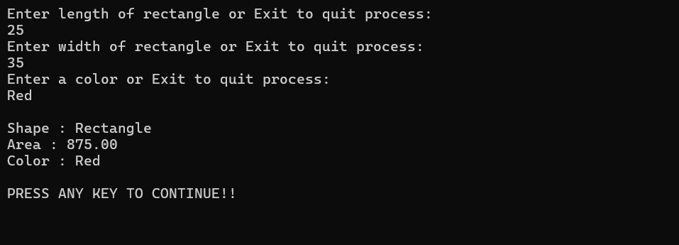

---

#  Employee Hierarchy Module

## Abstract Class: Employee

The Employee class serves as the common abstract model for organization employees.

### Properties

| Property | Type |
|-----------|------|
| Name | string |
| Salary | decimal |

### Methods

```csharp
double CalculateBonus();
void PrintDetails();
```

### Responsibilities

- Store employee details.
- Define bonus calculation behavior.
- Display employee information.

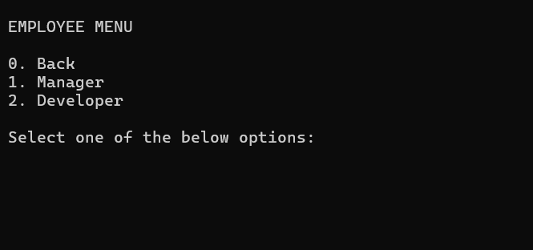

---

## Derived Class: Developer

### Bonus Rule

```text
Bonus = 15% of Salary
```

### Methods

```csharp
CalculateBonus()
PrintDetails()
```

### Example

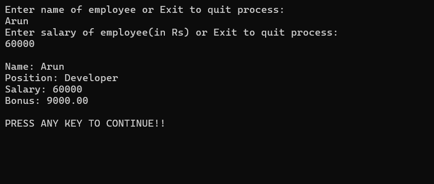

---

## Derived Class: Manager

### Bonus Rule

```text
Bonus = 20% of Salary
```

### Methods

```csharp
CalculateBonus()
PrintDetails()
```

### Example

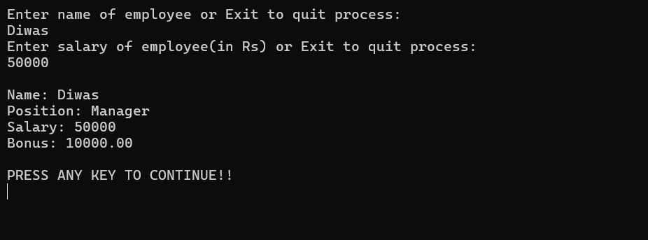

---

#  Bank Management System Module

## Abstract Class: BankAccount

The BankAccount class serves as the base abstraction for all account types.

### Properties

| Property | Type |
|-----------|------|
| AccountNumber | decimal |
| AccountHolderName | string |
| Balance | decimal |

### Methods

```csharp
Deposit
Withdraw
PrintDetails()
```

### Responsibilities

- Store account information.
- Handle deposits.
- Handle withdrawals.
- Display account information.

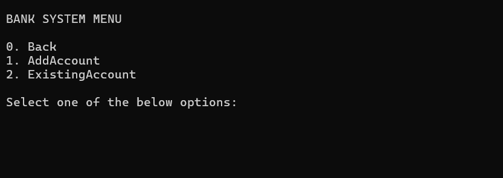

---

## Derived Class: SavingsAccount

### Features

- Deposit money.
- Withdraw money.
- Maintain balance.
- Display account information.

### Methods

```csharp
Deposit()
Withdraw()
PrintDetails()
```

### Example

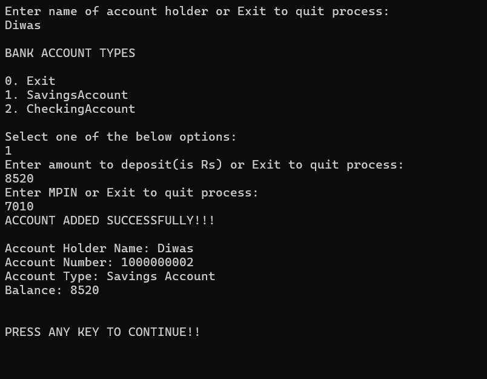

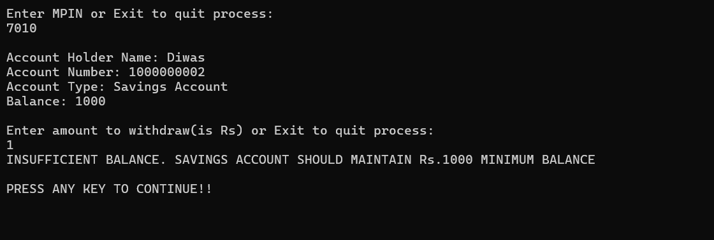

---

## Derived Class: CheckingAccount

### Features

- Deposit money.
- Withdraw money.
- Support frequent transactions.
- Display account information.

### Methods

```csharp
Deposit()
Withdraw()
PrintDetails()
```

### Example

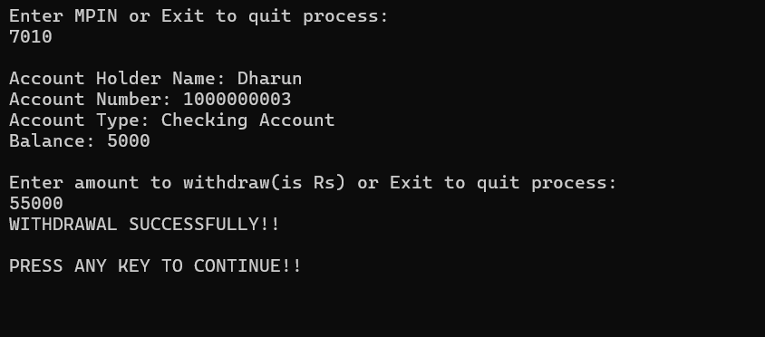

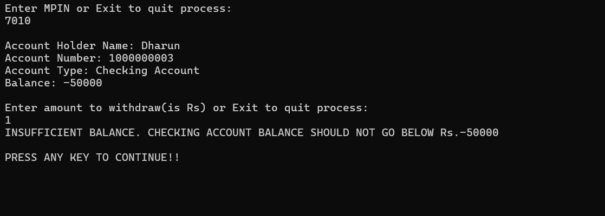

---

# Bank Services

## BankServices.cs

Acts as the service layer for banking operations.

### Responsibilities

- Create Account
- Deposit Money
- Withdraw Money
- View Account

### Operations

```text
1. Create Savings Account
2. Create Checking Account
3. Deposit
4. Withdraw
5. Display Account Details
```

---

# Repository Layer

## BankSystemRepo.cs

Responsible for account management and storage.

### Responsibilities

```text
Add Account
Find Account
```

The repository separates business logic from data management.

---

#  Validation Helper

## Validation.cs

Provides reusable validation methods.

### Responsibilities

```text
Validate Name
Validate Account Number
Validate Numeric Inputs
Validate Amount
Validate Menu Selection
Validate Mpin
```
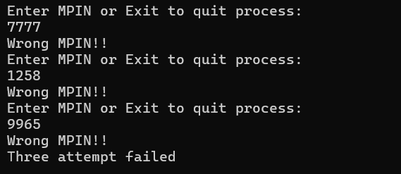
Regular expressions from `RegexPattern.cs` are used for input validation.

---

#  Constants

## BankConstants.cs

Contains banking-related constants.

Example:

```text
Minimum Balance
Default Deposit Amount
```

---

## MessageConstants.cs

Contains all display messages.

Examples:

```text
Invalid Input
Account Created Successfully
Withdrawal Successful
Insufficient Balance
```

---

## RegexPattern.cs

Contains reusable validation patterns.

Examples:

```text
Name Validation Pattern
```

---

#  Enum Constants

## MenuContent.cs

Stores menu options.

Example:

```text
Main Menu
Shape Menu
Employee Menu
Bank Menu
```

---

## BankAccountContent.cs

Stores banking content and account type options.

Example:

```text
Savings Account
Checking Account
Deposit
Withdraw
View Details
```

---

# View Layer

The View layer interacts with users and displays menus.

## MainMenu.cs

Responsible for displaying:

```text
1. Shape Hierarchy
2. Employee Hierarchy
3. Bank System
4. Exit
```

---

## ShapeHierarchy.cs

Handles:

```text
Circle Operations
Rectangle Operations
```

---

## EmployeeHierarchy.cs

Handles:

```text
Developer Details
Manager Details
```

---

## BankSystem.cs

Handles:

```text
Account Creation
Deposit
Withdraw
View Details
```

---

## DisplayEnum.cs

Displays enum values dynamically.

---

## ValidInput.cs

Responsible for collecting and validating user input.

---

#  Application Flow

```text
Start
  │
  ▼
Main Menu
  │
  ├────────► Shape Hierarchy
  │             │
  │             ├── Circle
  │             └── Rectangle
  │
  ├────────► Employee Hierarchy
  │             │
  │             ├── Developer
  │             └── Manager
  │
  └────────► Bank System
                │
                ├── Create Account
                ├── Deposit
                ├── Withdraw
                ├── Search Account
                └── Display Details
```

---


# 🛠️ Technologies Used

- OOP Principles
- Console Application


---

# 👨‍💻 Author

**Diwas Thangarasu**

OOPS Console Application developed as a practice project to demonstrate Object-Oriented Programming concepts and layered application architecture using C# and .NET.